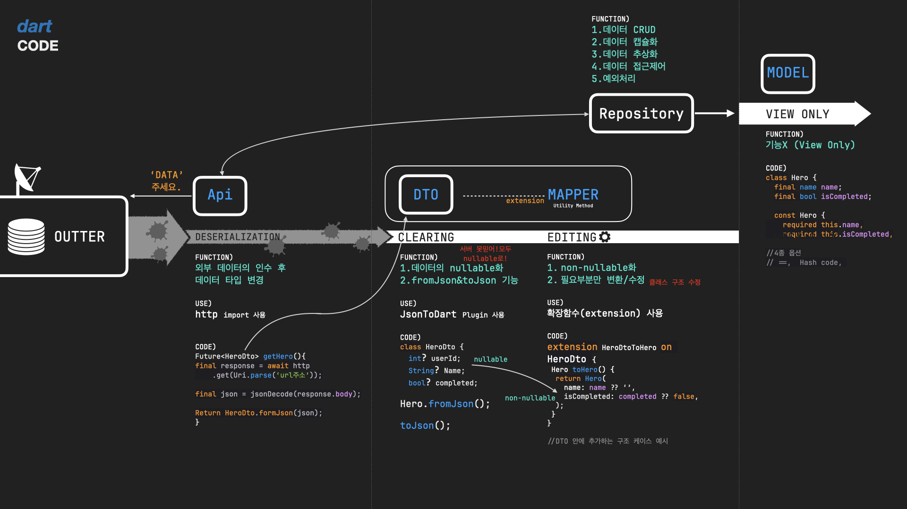
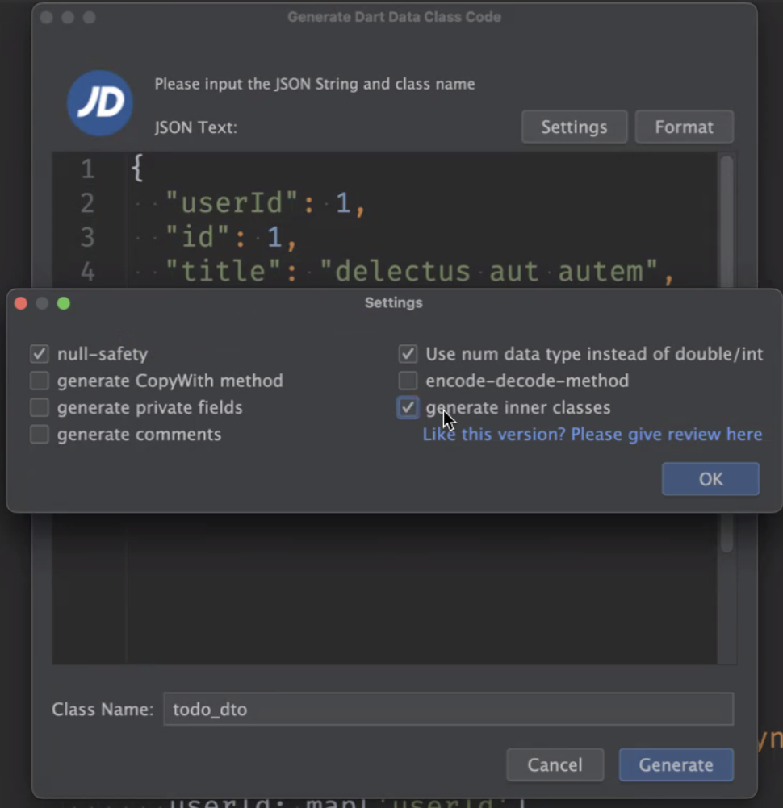

Date: 240328
>과제
~~~dart
// String은 리스트 처럼
// string[0] 이렇게 문자열에 접근할 수 있다.

// 회문 알고리즘. 속도가 빠르다.
bool isPalindrome(String input){
    int p1 = 0;
    int p2 = intput.length -1 ;
    bool result = true;

    while(p1 < p2){
        if(input[p1]) != input[p2]{
            result = false;
            break;
        }
        p1 += 1;
        p2 -= 1;
    }
    return result;
}

bool isPalindrome(String input){
    // 속도는 좀 느리지만 휴먼에러를 낮추는 안정적인 방법
 final reversedText = input.split('').reversed.join();
 retrun intput == reversedText;
}

// 구조분해. 첫번째, 두번째에 있는 값에 의미부여를 해서 사용.
final [one, two, ...] = numbers.sotred();
result = one + two;
// 이렇게도 쓸 수 있음. 사용할 변수 까지 쓰고 그 뒤에는 스프레드 연산자.
final [one, ... last] = numbers.sotred();
~~~
- 팩토리얼 재귀함수에 값을 크게 넣을 경우 터질 수 있음. 
- int는 계산 결과가 2^63-1이 넘어가면 음수로 되돌아간다. 꼬리재귀로 해결할 수 있음. 다트는 꼬리재귀 최적화 안해줌

--- 
># Dto, Mapper

- 동적 Json
  - 서버에서 아예 잘못된 값을 보내는 경우
- DTO
  - 데이터를 옮겨 담는 객체
  - 데이터 소스를 모델 클래스로 변환하는 과정에서 순수하게 클래스에 담기 위한 중간 객체
    Json - DTO - model class
  - DTO는 모든 필드가 nullable. 서버를 믿지 않는다. 언제든 예외 상황의 데이터가 올 수 있음에 염두하자.
  - nullable일 때는 as type을 뗀다.
  - 편하게 Json 데이터 파싱하는 플러그인
    - Json to Dart 
    
    - 만들고 코드정리 꼭 해주기
  - 이제 모델클래스에서는 ==, hashcode, toString, copyWith 만 있으면 된다.  
    그리고 필요 없는건 빼는 등 원하는 형태로 커스터마이징 하면 된다.
  - Mapper 가 DTO와 모델 클래스 사이에 연결 다리를 줌
    - toJson()도 mapper다.
    - extension을 만들어서 모델 클래스의 기능을 확장한다.
      - 서버에서 받는 건 DTO 클래스에, 보내는건 모델클래스에 확장자를 만들어서 사용.
  - DTO가 필요한 이유
    - Model Class 는 non-nullable 한 값만 가지고 있도록 한다
    - Json 데이터는 null 값을 포함할 수 있음 (문서에 명시되어 있지 않더라도…)
    - Map -> Model Class 변환시 null 값 등의 예외를 사전에 걸러내기 용이함
    - 불완전한 코드가 포함될 것 같다면 Dto를 도입하자
    - Json 값에 예외가 없다면 반드시 Dto를 도입할 필요는 없다
  - 기존 모델 클래스 6종 세트는 DTO와 모델클래스의 짬뽕이었다..!
    - DTO 가 도입된다면 역할 분담 가능
    - DTO : fromJson(), toJson()
    - 모델 클래스 : 불변 객체 (+ 나머지 4개는 옵션)

> ### 궁금한 점
 - 모델 클래스 두 개를 짬뽕한 DTO를 서버로 보내야 할 땐 어떻게 해야할까?
 - 내가 만든 HttpService 의 get 함수. http.Response를 리턴해야 하는 걸까...?
    ~~~dart
    class HttpService implements CustomHttpClient {
    @override
    Future<String> get(String url) async {
        final http.Response response = await http.get(Uri.parse(url));
        if (response.statusCode == 200) {
        return utf8.decode(response.bodyBytes);
        }
        throw Exception('http response error! ${response.statusCode}');
    }
    }
    ~~~
    => Response 클래스를 커스텀해서 만들어서 반환 타입으로 넣어주면 의존성을 해소할 수 있다.   
    바디만 넘길지 통채로 넘길지에 대한 고민이 해소될 수 있음.  
    데이터 가공도 일단 지금은 api에서 가져온 데이터소스를 레포지토리에서 DTO로 받아서 모델 클래스로 변환하는게 컨벤션.  
    데이터소스 받아오는 쪽에서 try-catch 처리도 했었으나 예외처리 할 수 있는게 없어서 결국 레포지토리나 더 앞에서 넘어와서  예외처리를 계속 해줘야 하는 일이 생기기 때문에... 
    근데 커스텀한 Response Class를 잘 사용하지 않을 것 같으면 굳이 만들 필욘 없다.
