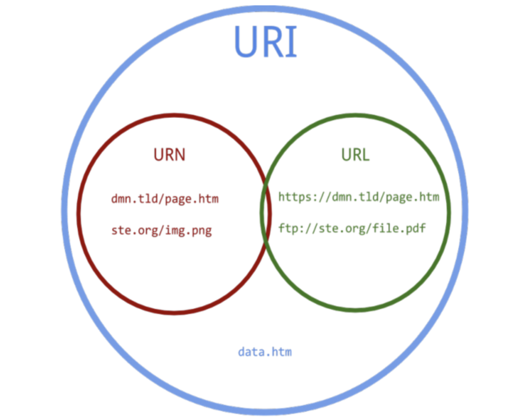
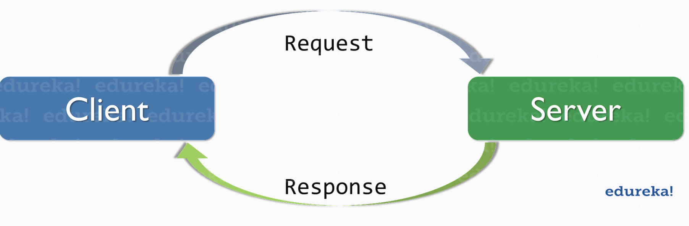
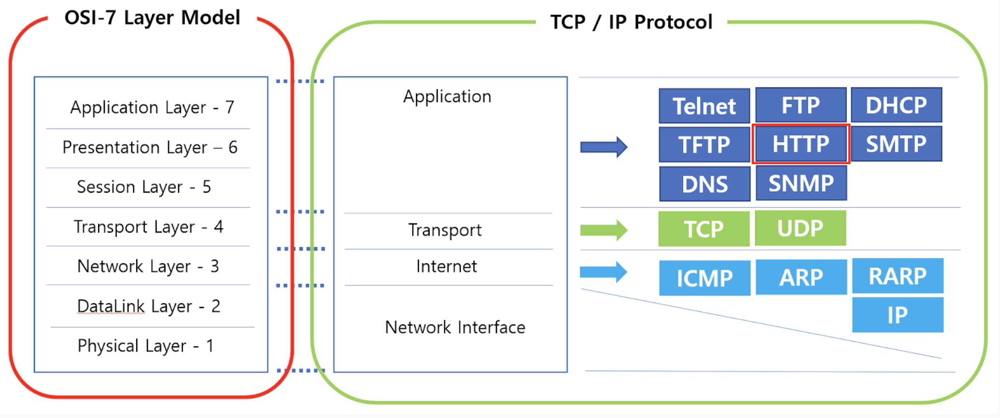

Date: 240329

- api라고 하면 보통 웹사이트에서 api 요청하는 그것을 말함.
- 좀 그러면 더 추상화 해서 dataSource라고 해도 됨
- json To Dart 쓸 때는 raw 데이터 때려박자.
- mapper
  - Dto 속에다 메서드를 넣었다면 extension(mapper)을 만들어서 빼는 것을 권장.
  ~~~dart
    extension ToStore on StoreDto{
        Store toStore(){
          return Store(
            name: name ?? '',
            address: addr ?? '',
            stockAt: stockAt ?? '',
            remainStatus: remainStatus ?? '',
          );  
        }
    }

    // DTO 에다가 값을 걸러버리면 나중에 수정사항이 생기면 난감해짐
    // dto는 그냥 받아오고 레포지토리에서 거르는 구현을 하도록 한다.

    return maskDto.stores!.where((e) => e.remainStat !=null && e.stockAt != null)
                           .map((e)=> e.toStore())
                           .toList();
    double.tryParse()
  ~~~

  - tryParse() 함수?
    - nullable 타입을 반환하는 함수로, 값이 유효하지 않을 경우 null 값을 반환한다.
    - try가 붙지 않은 parse() 함수는 exception이 터지게 된다. int의 경우 최소 하나 이상의 숫자로 이루어진 문자열이어야 한다.
  ~~~dart
   external static int parse(String source, {int? radix});

   external static int? tryParse(String source, {int? radix});

   /// print(int.tryParse('2021')); // 2021
   /// print(int.tryParse('1f')); // null
  ~~~
    
  ----
     

># 네트워크 통신

> URL? URI?
> 

  - URI는 인터넷 상의 자원을 식별할 수 있는 문자열을 지칭하는 말이다.
  - URL과 URN은 하위개념으로써 특정한 표준에 따라 자원을 식별하는 것임. 
  - URL은 네트워크 상에서 리소스(웹 페이지, 이미지, 동영상 등의 파일) 위치한 정보를 나타낸다.
  - URN은 URI의 표준 포맷 중 하나로, 이름으로 리소스를 특정하는 URI이다.  
    http와 같은 프로토콜을 제외하고 리소스의 name을 가리키는데 사용된다.
    URN에는 리소스 접근방법과, 웹 상의 위치가 표기되지 않는다.
    실제 자원을 찾기 위해서는 URN을 URL로 변환하여 이용한다

> JSON
  - 서버-클라이언트 통신에서 표준처럼 사용되는 데이터 교환 형식이다.
  - 가볍고 사람이 읽기 쉽다
  - Map 과 같은 간단한 구조
  - 직렬화 하여 문자열로 나타내기 쉽다
  - 대부분의 언어가 이를 파싱할 수 있기 때문에 상호 운용성은 걱정할 것이 없다

> HTTP/HTTPS
- 개념
  - HyperText Transfer Protocol
  원래 문서 전송용으로 설계된 상태 비저장용 프로토콜.  
  브라우저가 GET 요청으로 웹 서버의 문서를 읽어오는 용도였음  
  지금은 서버와 클라이언트가 텍스트, 이미지, 동영상 등의 데이터를 주고 받을 때 사용하는 프로토콜로 확장됨  
  웹 상에서 보는 이미지, 영상, 파일과 같은 바이너리 데이터도 HTTP 멀티파트나 Base64 인코딩하여 사용

- 무상태성
  - http는 상태 비저장 프로토콜
  - 요청메세지 보내기 전 까지 대상 컴퓨터가 응답 가능한지 알 방법이 없음
  - stateless 프로토콜.  
  
- HTTP 요청과 응답

    - 모든 http 메세지는 요청과 응답이 일대일로 대응되어야 한다.
    - 클라이언트는 항상 자신이 보낸 요청에 대한 응답을 알 수 있어 로직이 단순해지는 장점
  - 응답 없음
    - 일정시간 응답 없을 시 요청 실패로 간주
  - 실무에서 응답 없음
    - 실제로 제대로 처리 됐어도 응답이 늦게 와서 타임아웃 나는 경우
    - 안드의 경우 10초 이내 응답 없을 시 타임아웃으로 간주
    - ios는 60초
  - 예측이 어려운 응답 없음
    - 서버가 해외일 경우
    - 클라우드 기반 서버일 경우
    
- OSI-7계층

- 물리 계층 (Physical Layer)  
데이터를 전송하는 데 필요한 실제 물리적 매체에 대한 전송을 담당합니다.
전압, 주파수, 비트를 전송하는 방법을 정의합니다.
예시: 이더넷 케이블, 광섬유 케이블, 무선 신호 등

- 데이터 링크 계층 (Data Link Layer)  
물리 계층으로부터 받은 데이터를 프레임으로 구성하고, 에러를 검출하고 수정합니다.
노드 간의 직접적인 통신을 제공합니다.
예시: 이더넷, Wi-Fi, PPP(Point-to-Point Protocol) 등

- 네트워크 계층 (Network Layer)  
패킷을 전송하고 경로를 선택하며, 패킷의 전송을 관리합니다.
라우팅, 흐름 제어, 오류 처리 등을 수행합니다.
예시: IP(Internet Protocol), ICMP(Internet Control Message Protocol) 등

- 전송 계층 (Transport Layer)  
종단 시스템 간의 데이터 전송을 관리하고, 데이터 전송의 신뢰성을 제공합니다.
데이터의 전송, 흐름 제어, 오류 복구 등을 수행합니다.
예시: TCP(Transmission Control Protocol), UDP(User Datagram Protocol) 등

- 세션 계층 (Session Layer)  
통신 세션을 설정, 유지 및 해제하여 데이터 교환을 관리합니다.
세션 동기화, 오류 복구, 토큰 관리 등을 수행합니다.

- 표현 계층 (Presentation Layer)  
데이터의 형식을 변환하고, 데이터의 압축 및 암호화를 수행합니다.
데이터의 표현과 형식을 관리합니다.

- 응용 계층 (Application Layer)  
최종 사용자가 직접 사용하는 응용 프로그램과 직접 상호 작용합니다.
HTTP, FTP, SMTP 등과 같은 응용 프로토콜이 이 계층에 속합니다.

> 소켓을 사용한 저수준 액세스  

> TCP
- 저수준 : 컴터가 이해하기 쉽게 작성된 프로그램 또는 api
- 신뢰성 있는 연결 지향성 앱에서 사용 (이메일, 파일전송, 웹브라우저)
- 연결을 끊기 전까지 계속 메세지를 주고받는 프로토콜
- 빨대 꽂아놓고 데이터 왔다갔다
- 접속하기 위해서는 IP번호와 포트 번호가 필요함  
    http://104.198.248.76:3000/
> UDP
- 신속한 데이터 전송이나 손실 가능성이 있는 상황에 주로 사용
- 비연결형 프로토콜
- 신뢰성 낮음, 흐름 제어 없음, 단순성
- 멀티캐스팅 및 브로드 캐스팅 - (예) 스트리밍  
 => TCP는 HTTP보다 빠르지만 개발자가 할 일이 많다  
    HTTP는 로직이 간단하지만 TCP보다는 느리다

> 요청 메서드
 - 요청의 형태를 정의하는 것이 키워드
  - 상황에 맞게 사용하는 것이 관례
- GET : 데이터 요청
  - body를 포함할 수 없음
  - ?와 & 문자를 사용하는 쿼리 파라미터를 추가할 수 있다

- POST : 데이터가 포함된 요청
- DELETE : 삭제
- PUT : 전체 내용 업데이트
- PATCH : 일부 내용 업데이트
  
> HTTP 요청 헤더  
- 요청 정보를 파악하는 데 도움이 되는 다른 여러 정보를 포함할 수 있음  
주로 인증, 캐싱, 클라이언트 힌트, 조건, 연결 관리, 쿠키, CORS 등에 활용  
JSON 파일을 주고 받을 때 Content-Type 에 application/json 으로 명시   

> 상태 코드
- 모든 HTTP 응답에는 상태 코드와 상태 메시지가 있음  
  - 200 OK
  - 400 Bad Request
  - 404 Not Found
  - 500 Internal Server Error

> 세션과 쿠키
- HTTP는 상태라는 개념이 존재하지 않기 때문에 세션과 쿠키를 사용해 구분
주로 웹에서 서버는 세션, 클라이언트는 쿠키를 통해 상태 저장

- RESTful API
  - 서버와 클라이언트가 메세지를 주고받을 때 사용하는 통신 규격
  - REST: 분산 시스템을 위한 소프트웨어 아키텍처의 한 형태  
  - RESTful 이란 REST 조건을 만족한다는 뜻  
  - 요청 주소(URL)과 메서드(GET, POST 등), JSON 규격을 이용하여 API를 정의  
  - 오늘날 가장 범용적으로 사용  
- REST API 도구 > https://www.postman.com/

> json 직렬화 코드 제네레이션 기법   

  [공식문서 참고 ](https://docs.flutter.dev/data-and-backend/json#serializing-json-using-code-generation-libraries)  
  JsonSerializable 라이브러리는 fromJson(), toJson() 을 자동으로 생성해 주고
  필드명을 바꿀 수 있는 것 외에도 DTO, Model 을 하나로 합칠 수 있는 여러 기능을 제공한다.
  현업에서 많이 사용한다. 그러니 사용 방법을 알아둬야 한다.

---- 

> 자주 사용하는 Flutter CLI 명령어
~~~
flutter doctor : 문제점 파악

(flutter/dart) upgrade : 현재 메이저 버전의 하위 버전 중에서 최신 버전으로 업그레이드 

(flutter/dart) pub get : 수정 사항 반영

flutter clean : 빌드 파일 삭제

flutter run : 실행

(flutter/dart) pub upgrade --major-versions : 메이저 버전의 최신 버전으로 업그레이드

(flutter/dart) pub add [라이브러리이름] : pubspec.yaml 파일에 자동 추가 후 pub get 까지
~~~

----

>## 데코레이터 패턴
Decorator(데코레이터) 디자인 패턴은 특정 객체에 대해서 새로운 기능을 동적(Run-time)으로 추가하기 위한 구조 설계 패턴.  
객체에 동적으로 기능을 추가하고 코드의 추가를 숨기고 싶은 경우 사용하면 좋다.  
또한 상속을 통해서 객체를 확장할 수 없는 경우에서도 사용할 수 있다.