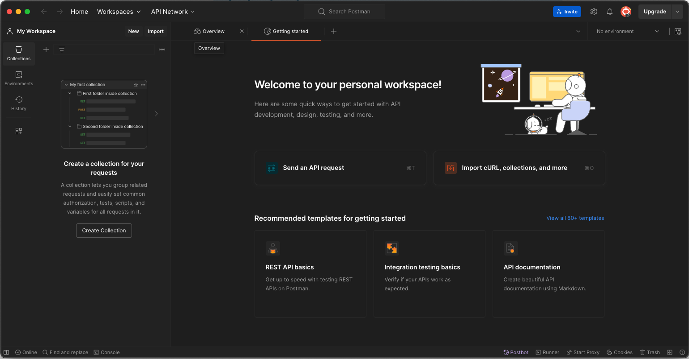
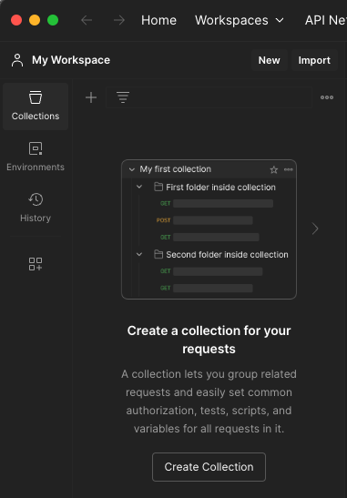
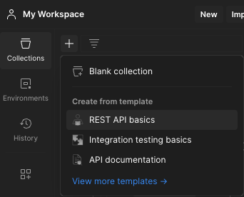
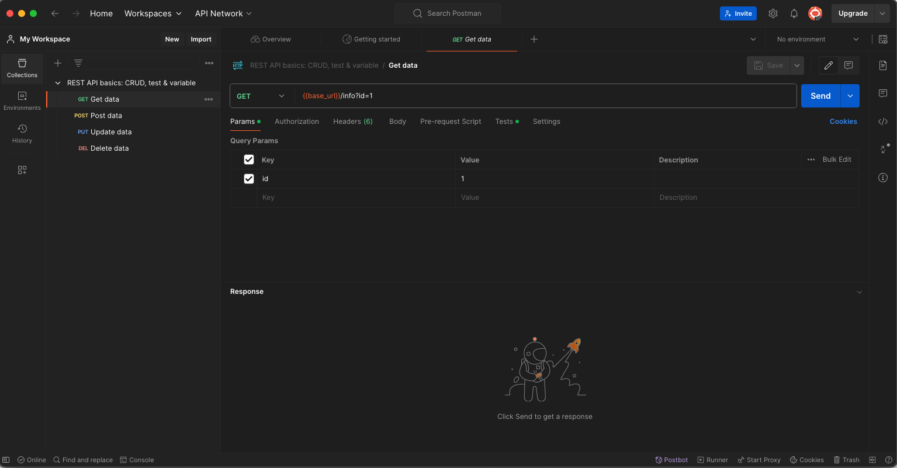
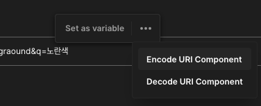
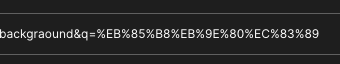

Date: 240401

## GIT
checkout과 switch의 차이? (https://velog.io/@kms8571/git-switch-restore#2-git-checkout%EC%9D%98-%EA%B8%B0%EB%8A%A5)
- switch : brach 변경 및 생성 후 HEAD가 가르키는 브랜치 이동
- restore : 특정 파일 또는 stage 의 내용을 HEAD 커밋으로 복원
  
- 플러터 개발자 로드맵 (https://roadmap.sh/flutter)
- Isolate
  - 선언시 별도로 UI에 영향을 주지 않고 동작함.
  - 플러터는 스레드를 조작하는게 없어서, 별도 스레드에서 동작하는 것 처럼 쓴다.
  - 격리 공간이 따로 생긴다.

---- 

>Result 패턴
- 성공, 실패 처리시 유용한 패턴
- 성공시에는 데이터를, 실패시에는 Exception(또는 String)을 담는 객체를 정의한다

- sealed 클래스 타입 봉인 효과 
  - enum 처럼 쓸 수 있고 다른 객체의 참조를 가질 수 있다.
  ~~~dart
   sealed class Result<T> {
    factory Result.success(T data) = Success;

    factory Result.error(Exception e) = Error;
    }

    class Success<T> implements Result<T> {
    final T data;

    Success(this.data);
    }

    class Error<T> implements Result<T> {
    final Exception e;

    Error(this.e);
    }

  ~~~
- Result 패턴을 도입하는 곳에서 응답 객체를 Result 클래스로 랩핑한다.
  ~~~dart
    Future<Result<List<Photo>>> fetch(String query);
  ~~~
- Result 패턴을 쓰면 switch문을 사용해서 강제로 모든 케이스에 대한 처리를 하도록 할 수 있다.
  3개 이상의 성공, 실패 처리를 할 일이 있다면 유용함.
  ~~~dart
    switch (photos) {
      case Success<List<Photo>, ErrorType>():
        print(photos.data);
      case Error<List<Photo>, ErrorType>():
        {
          switch (photos.error) {
            case ErrorType.unknown:
              print('알 수 없는 네트워크 에러');
            case ErrorType.requestTimeOut:
              print('타임 아웃');
            case ErrorType.typeError:
              print('타입 에러');
            case ErrorType.profanityIncluded:
              print('비속어를 사용 할 수 없습니다.');
          }
        }
      }
  ~~~

> freezed 라이브러리  

[> 공식문서보러가기](https://pub.dev/packages/freezed)
- freezed = json_serializable + Equatable + Immutable 합친 느낌
- 에러 자체를 한글로 프린팅하면 로컬화 할 때 껄끄러우므로 이넘을 둬서 나라마다 교체하는 식으로 구현하면 좋음.  
- toJson / fromJson 함수를 제공해 json으로 쉽게 serialize / deserialize 할 수 있도록 돕는다. 
- equals (==)와 hashCode를 자동으로 작성해준다.
- 선언된 필드들의 getter를 만들어서 외부에서 값을 변경할 수 없도록 한다. 
- copy와 copyWith을 자동으로 구현해주고, 종속성을 가지는 하위 클래스들에 대해서도 쉽게 deepCopy 할 수 있도록 도와준다.
- sealed class 작성을 편하게 해 준다

 

설치 및 구현 방법 
  

[설치]  
~~~
dart pub add freezed_annotation
dart pub add dev:build_runner
dart pub add dev:freezed
// fromJson(), toJson()
dart pub add json_annotation
dart pub add dev:json_serializable
~~~

[구현 방법]
 - 템플릿으로 넣어서 써도 되고, 직접 작성해도 된다.
 - 작성 후에는 빌드 명령어를 터미널에 실행시켜준다.
 - 빌드 명령 : dart run build_runner build --delete-conflicting-outputs

~~~dart
/// data class = 모델 클래스 만들기 
/// 필드는 원하는 것으로 채운다.
import 'package:freezed_annotation/freezed_annotation.dart';

part '[클래스 이름].freezed.dart';

part '[클래스 이름].g.dart';

@freezed
class [클래스 이름] with _$[클래스 이름] {
  const factory [클래스 이름]({
    required String title,
    required String body,
    @Default(false) bool isCompleted,
  }) = _[클래스 이름];
  
  factory[클래스 이름].fromJson(Map<String, Object?> json) => _$[클래스 이름]FromJson(json); 
}

/// data class = 모델 클래스 만들기 (템플릿)
import 'package:freezed_annotation/freezed_annotation.dart';

part '$NAME$.freezed.dart';

part '$NAME$.g.dart';

@freezed
class $CAP_NAME$ with _$$$CAP_NAME$ {
  const factory $CAP_NAME$({
    $END$
  }) = _$CAP_NAME$;
  
  factory $CAP_NAME$.fromJson(Map<String, Object?> json) => _$$$CAP_NAME$FromJson(json); 
}

/// seald 클래스 만들기
import 'package:freezed_annotation/freezed_annotation.dart';

part '[클래스 이름].freezed.dart';

@freezed
sealed class [클래스 이름]<T> with _$[클래스 이름]<T> {
  const factory [클래스 이름].success(T data) = Success;
  const factory [클래스 이름].error(String e) = Error;
}

/// seald 클래스 만들기 (템플릿)
import 'package:freezed_annotation/freezed_annotation.dart';

part '$NAME$.freezed.dart';

@freezed
sealed class $CAP_NAME$<T> with _$$$CAP_NAME$<T> {
  const factory $CAP_NAME$.success(T data) = Success;
  const factory $CAP_NAME$.error(String e) = Error;
}

// 빌드 명령 : dart run build_runner build --delete-conflicting-outputs
~~~

  

---- 
  
>  포스트맨을 사용하여 Pixabay에 있는 이미지를 가져와보자! (Mac 환경)  
-> [Pixabay API 문서 보러가기](https://pixabay.com/api/docs/#api_search_images)  

1. 포스트맨을 다운받아서 연다.  
   

1. 좌측 사이드바에 `collections` 버튼을 클릭한다.  
  

1. REST API basics를 누른다.  

1. 그러면 이렇게 GET, POST, PUT, DEL 라고 응답 요청 타입 목록이 생긴다.   
이 중에 GET을 누른다. 왜냐하면 pixabay에다 원하는 이미지를 달라고 요청할 것이기 때문!
   

1. 요청할 준비가 되었으면 pixabay api 문서로 가서 어떤 주소로 요청을 보내야 하는지 살펴보자.   
GET으로 보내야 하고, 기본 주소는 https://pixabay.com/api/ 이래야 한다고 쓰여있다.  
그리고 필수로 들어가야 하는 파라미터가 `key` 로 내 API 키를 요구하고 있다.

 
1. 다시 포스트맨으로 돌아가서 URL 넣는 칸에 기본 주소를 붙여 넣어준다.   
아까 파라미터로  `key`를 넣어주라고 했으니까 아래 Params 탭을 선택하고 키 이름과 값을 넣는다.
  

1. send 버튼을 누르면 이렇게 결과가 뜬다.  
  

1. 좀 더 상세히 내가 원하는 이미지들을 검색해서 불러와 보자. 다시 공식문서로 가서 읽어본다.  

  - 원하는 키워드를 넣어 검색 할 수 있는 키  
    
  - 카테고리 필터. 특정 카테고리를 정해서 검색 할 수 있다.  
    
  - 이미지 방향. 가로인지 세로인지 둘 다 포함 할 것인지 정할 수 있다.
  

    여러 옵션 중 나는 배경화면으로 쓸 예쁜 사진을 찾기 위해 이렇게 파라미터를 넣어주었다. 
      
  

유의사항  
- 한글의 경우 인코딩을 해서 파람값을 넣어줘야 한다! 주소창에서 원하는 값을 블럭잡고 오른쪽 버튼 > Encode URI Component    
  

!! 끝 !! 참 쉽죠? ^.^

 HTTP 응답 결과값 & 이미지 

 ~~~~json
{
    "total": 1488443,
    "totalHits": 500,
    "hits": [
        {
            "id": 8660483,
            "pageURL": "https://pixabay.com/illustrations/flowers-botany-bloom-blossom-8660483/",
            "type": "illustration",
            "tags": "flowers, botany, bloom",
            "previewURL": "https://cdn.pixabay.com/photo/2024/03/28/08/00/flowers-8660483_150.jpg",
            "previewWidth": 150,
            "previewHeight": 107,
            "webformatURL": "https://pixabay.com/get/g5334ae2799657bc77d7da6fe4f6df0b7178b3aafc2a71a8799fd787be93f37ba2a2bb87d1baf50c61f726f5af58ae4b7_640.jpg",
            "webformatWidth": 640,
            "webformatHeight": 455,
            "largeImageURL": "https://pixabay.com/get/ga0e41473382e90a34d5ee9450b03ca9ed02176d63578b1bf92589835fcd385d1f69dc6785788d73ad0585518fd2596d4cb8c402d2ce2244a48fd7d8fb531420d_1280.jpg",
            "imageWidth": 5853,
            "imageHeight": 4160,
            "imageSize": 3403549,
            "views": 775,
            "downloads": 597,
            "collections": 3,
            "likes": 59,
            "comments": 0,
            "user_id": 10327513,
            "user": "NickyPe",
            "userImageURL": "https://cdn.pixabay.com/user/2024/02/05/16-05-14-742_250x250.jpg"
        },
        {
            "id": 8660473,
            "pageURL": "https://pixabay.com/illustrations/blossoms-cherry-blossoms-pink-bloom-8660473/",
            "type": "illustration",
            "tags": "blossoms, cherry blossoms, pink",
            "previewURL": "https://cdn.pixabay.com/photo/2024/03/28/07/52/blossoms-8660473_150.jpg",
            "previewWidth": 150,
            "previewHeight": 100,
            "webformatURL": "https://pixabay.com/get/g07637a8d484c47fcfe4b06cfbbab7a000ffad263354997ca977d0cd2810bc0d5e5119e5ba853e76c6a06698cbfdf70a4_640.jpg",
            "webformatWidth": 640,
            "webformatHeight": 427,
            "largeImageURL": "https://pixabay.com/get/g341dbde1b16c21932cd46dda81d3031de222d35df29553367859cf153ed71e63e9d98602d8587a542c69115883892320f62e6372b5b252017be960522350f310_1280.jpg",
            "imageWidth": 6240,
            "imageHeight": 4160,
            "imageSize": 4254423,
            "views": 769,
            "downloads": 636,
            "collections": 4,
            "likes": 54,
            "comments": 0,
            "user_id": 10327513,
            "user": "NickyPe",
            "userImageURL": "https://cdn.pixabay.com/user/2024/02/05/16-05-14-742_250x250.jpg"
        },
        (... 생략)
    ]
}
~~~~

