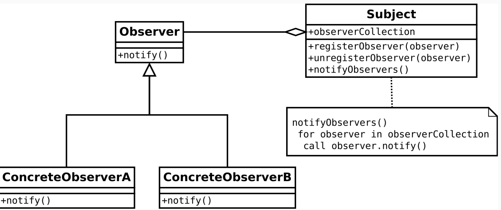

Date: 240402

~~~dart
StackTrace s 에러난걸 쭉 보여주는 클래스

try{
  ...
}catch(s,e){
  print('$e ::: $s');
}

// 이런 식으로 사용
~~~

- 데이터소스에서 뭘 리턴하는게 좋냐. DTO를 전달하는게 가장 좋은 방법은 아니다.
- Exception class 를 상속받는게 일반적.
- env 파일에 숨겨야 하는 키값을 넣는다.
- freezed의 when/map 함수는 레거시라 언젠가 사라질 수 있으니 사용에 유의.
  - 패턴매칭을 사용하자.
- 모키토 - 어떤 인자를 넘겨줬는지 테스트를 하는거라 추적하는 기능을 갖고있다.
- 메서드 안에서는 private이 은닉화가 안되므로 소용이 없다. 할 필요 없음
- Dart Class Tools 플러그인
  
  ----
>## 설계원칙, 디자인 패턴

> 좋은 설계 원칙이란?  
 
- 널리 알려진 설계 원칙을 배우고 의식하며 개발을 하자
- 책 추천 : 객체지향의 사실과 오해, 헤드퍼스트 디자인 패턴, 내 코드가 그렇게 이상한가요?

> 응집도와 결합도
 - 응집도 (Cohesion)  
   - 모듈이 하나의 목적을 수행하는 요소들간의 연관성 척도  
   - 모듈 내부의 기능적인 응집 정도를 나타냄
 - 결합도 (Coupling)  
   - 모듈이 다른 모듈에 의존하는 정도의 척도
   - 모듈과 모듈간의 상호 결합 정도를 나타냄
> 6가지 코드 작성의 원칙

자세히 보기 
  

- DRY 중복 코드 메소드로 분리
- PIE 명확하고 표현력 있게 기술하자 
- SRP 1클래스 1기능
- OCP 개방 폐쇄 원칙
  - 수정 없이 확장 가능하도록 하자
  - 인터페이스 적극 활용 하자
- 클래스의 의존 관계와 수정의 영향 => 의존성이 크면 수정할 때 여러군데를 바꿔야 하는 일이 생긴다..
- DI 생성자를 통해 테스트 가능한 종속 항목 삽입
- SDP 안전한 것에 의존하라
  - 변경이 없으면 클래스라도 의존해도 괜찮다.
  - 하지만 가장 좋은 것은 특정 클래스가 아니라 인터페이스에 의존하는 것이다
  - 클래스는 생성자가 변하거나 할 수 있으나 인터페이스는 거의 그대로이니까.

- ADP 의존성 사이클이 생기지 않게 한다
- SOLID 원칙
    - 요즘 뜨는 원칙
    
- 리스코프 치환 원칙 : 다형성, 인터페이스 구현해라 = is a 원칙.
- 인터페이스 분리 원칙
- 의존 관계 역전 원칙

 

----   
 

> 디자인 패턴  
  - 디자인 패턴은 프로그래머가 어플리케이션이나 시스템을 디자인할 때 공통된 문제들을 해결하는데에 쓰이는 형식화 된 가장 좋은 관행이다.   
  => 설계 원칙과 노하우를 정리한 것. 선배님들이 정리한 것을 공부하자.

  - 장점 
    -  개발자간에 커뮤니케이션이 원만해 진다
    -  객체지향 설계 원칙의 이해도가 좋아진다  
    
  - GoF의 23가지 디자인 패턴  
    - 네모 박스는 초보 떄 주로 사용하는 패턴. 당장 알기에 충분한 것임
   

> 아키텍쳐 디자인 패턴
  - MVC, MVC2, MVP, MVI, MVVM

- Factory 패턴 : 인스턴스를 만드는 패턴
- Singleton 패턴
  - 객체의 인스턴스가 오직 1개만 생성되는 패턴을 의미한다. 주로 빈번히 사용하는 Database 등의 인스턴스 생성을 제한할 때 많이 사용한다.

- Decorator 패턴
  
- Iterator 반복 구조
  
- Facade - 내부를 감추고 심플하게  
  - 이사를 가면 주소를 변경할 때, 주민센터, 카드회사, 학교 등에 알려야 한다. 이를 하나하나 일일이 하는 것은 매우 귀찮기 때문에 한번에 해 주는 서비스가 있다면 그것을 이용하면 된다는 이론
  - Repository 패턴이 Facade 패턴이다
  

- strategy 패턴 : 전략 패턴. 갈아끼우기 쉽게 만들자.
    

    

    

  

 - 옵저버 패턴 :  콜백함수
 
    

    - 옵저버 패턴(observer pattern)은 객체의 상태 변화를 관찰하는 관찰자들, 즉 옵저버들의 목록을 객체에 등록하여 상태 변화가 있을 때마다 메서드 등을 통해 객체가 직접 목록의 각 옵저버에게 통지하도록 하는 디자인 패턴이다. 
    주로 분산 이벤트 핸들링 시스템을 구현하는 데 사용된다. 발행/구독 모델로 알려져 있기도 하다.
    
      
        
    

 

- repository 패턴
    - Repository 패턴은 소프트웨어 개발에서 데이터 저장소에 접근하는 객체를 추상화하고, 
      데이터소스(DB, File 등)와의 통신을 담당하는 객체를 캡슐화하는 디자인 패턴
      
    - repository는 저장소. 데이터의 제공과 조작을 할 수 있는 곳이다.  
      interface class로 repository에 데이터 가공을 위한 함수를 명시해놓고 이를 활용하는 클래스에서 직접 구현한다.  
      주로 service, manager, view model, controller 등..   
       
      
      - 이렇게 인터페이스를 통해 관리한다.  
      
      

- UI는 유저 인풋, 화면 출력 등이 이뤄지는 곳.
- 비즈니스 로직은 Repository 를 활용하여 앱의 기능을 제공하는 클래스가 제공하는 기능을 말함.
  - 회원조회, 회원등록, 회원수정, 회원삭제, 삭제취소,뒤로 등

---- 
도서관 과제  
힌트 커맨드 패턴, 메멘토 패턴 - > ... 여기까지는 찾아 보지도 못했음...

 

 UML로 그린 도서 대출 반납시스템 설계도 

  
  

- Facade 패턴을 사용해서 문제점을 해결 해 보았는데.. 아직도 알쏭달쏭 하다.
- 비지니스 로직과 facade 클래스의 연결고리가 조금 모호...  

 [> 상속과 합성에 대한 글 읽기 ](https://mangkyu.tistory.com/199)
  - 상속의 용도 
    - 1. 타입 계층을 구현하는 것 
    - 2. 코드를 재사용하는 것 -> 제약이 많음.
  - 상속 고려시 만족되는지 확인해야 할 사항. 이게 만족하지 않다면 거의 합성을 사용하는 것이 좋다.
    - 1. 부모와 자식 클래스가 Is-A 관계인 경우
    - 2. 행동 호환성이 만족하는 경우
    - 행동 호환성?   
      클라이언트의 입장에서 부모 클래스와 자식 클래스의 차이점을 몰라야 하며, 부모 클래스의 타입으로 자식 클래스를 사용해도 무방함을 의미한다. 클라이언트의 관점에서 두 타입이 동일하게 행동할 것이라고 기대한다면 두 타입을 묶을 수 있다. 만약 그렇지 않다면 두 타입을 하나의 타입계층으로 묶어서는 안된다.  
