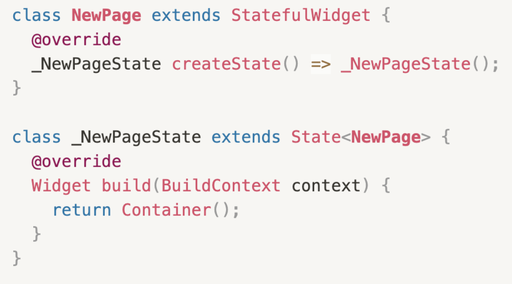
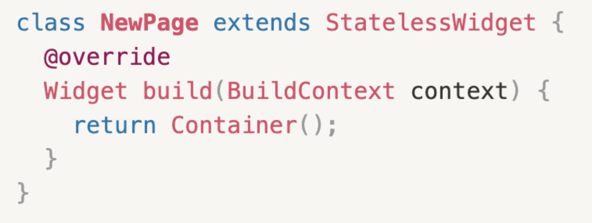
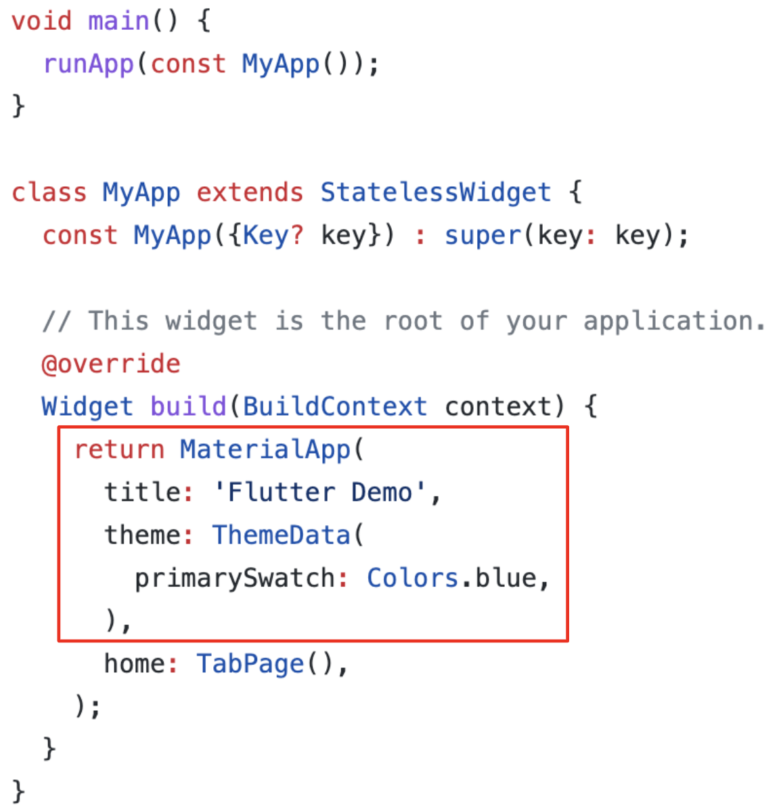
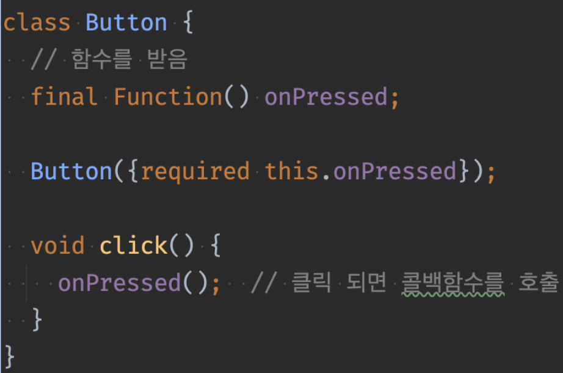
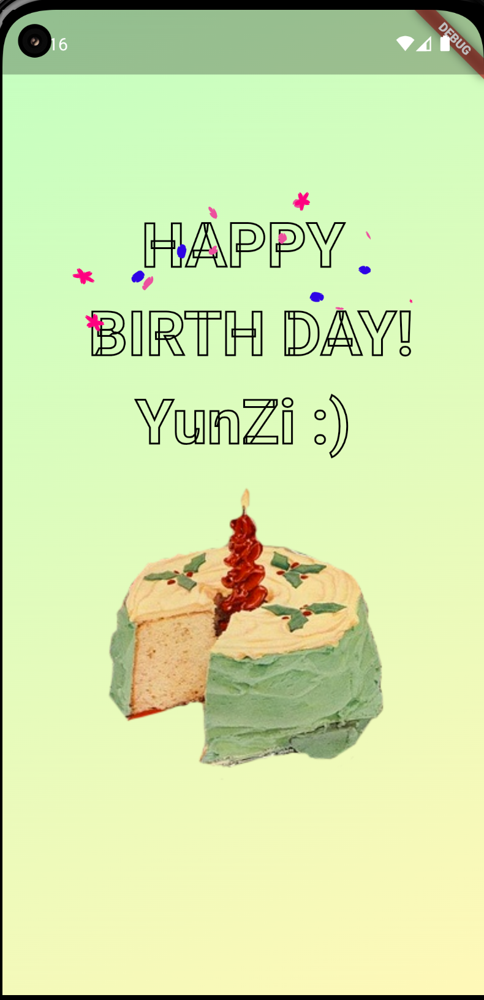
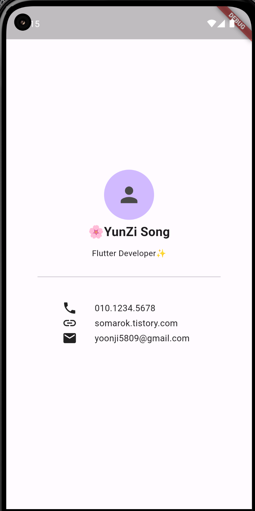

> StatefulWidget
 - 상태를 가지는 위젯. 화면 갱신에 영향을 주는 변수가 있다면 이 위젯을 사용한다.
 - setState()함수를 호출하여 화면 갱신.
 - 생명주기 함수가 별도로 존재
 - 라이브 탬플릿 ㅣ stful  
  
    

> StalessWidget
- 상태가 없는 위젯
- 정적인 화면을 나타낼 때 사용
- 라이브 탬플릿 | stless  

     

> 시작점 
- main()
> MaterialApp
- android 스타일로 개발할 때 최상위 위젯으로 설정해야 한다.
- IOS 스타일은 cupertinoApp  
    

> 외부 위젯과 상호작용 시 콜백함수 활용
- 위젯의 상태값은 위젯 외부에 있어야 값처리에 따른 UI 변화 핸들링을 하기 좋다.  

- 

> Asset
- 앱 내에 포함하는 모든 정적 파일 (이미지, 폰트, mp3 등 전부 가능)
- 루트에 Asset 폴더를 만든 후 pubspec.yaml에 경로를 넣어준다.
    ~~~dart
     flutter:
        assets:
          - assets/images/
          - assets/icons/
          - assets/background.png

      --------------------------------------
      // 사용시 이렇게
      Image(image: AssetsImage('assets/background.png'));
    ~~~
---- 
>공부법
- [공식문서 읽기](http://docs.flutter.dev/development/ui/widgets)
- [플러터 유튜브 채널 - '이 주의 위젯' 영상 보기](https://www.youtube.com/@flutterdev)
- 또는 플러터 유튭채널에서 'The Boring Flutter Development Show' 도 심심할때 보는 것 추천..

----

- 오늘의 결과물 : 생일카드, 비즈니스 카드  
[> 깃헙에서 코드보기](https://github.com/somarok/flutter_cards.git)  
  

> Lottie 사용법
 1. 로티 라이브러리를 받는다.
 ~~~dart
 flutter pub add lottie
 ~~~
 2. [로티 라이브러리 페이지](https://pub.dev/packages/lottie/example)
 ~~~dart
 /// 샘플 
    import 'package:flutter/material.dart';
    import 'package:lottie/lottie.dart';

    void main() => runApp(const MyApp());

    class MyApp extends StatelessWidget {
    const MyApp({super.key});

    @override
    Widget build(BuildContext context) {
        return MaterialApp(
        home: Scaffold(
            body: ListView(
            children: [
                // Load a Lottie file from your assets
                Lottie.asset('assets/LottieLogo1.json'),

                // Load a Lottie file from a remote url
                Lottie.network(
                    'https://raw.githubusercontent.com/xvrh/lottie-flutter/master/example/assets/Mobilo/A.json'),

                // Load an animation and its images from a zip file
                Lottie.asset('assets/lottiefiles/angel.zip'),
            ],
            ),
        ),
        );
    }
    }
 ~~~

 3. 로티 애니메이션을 컨트롤 하고 싶다면
 ~~~dart
  /// StatefulWidget을 만들고 State 클래스에 with TickerProviderStateMixin을 한다.
  /// 애니메이션 컨트롤러를 하나 만들어서 조작한다.

    class _BirthDayCardState extends State<BirthDayCard>
        with TickerProviderStateMixin {
    late final AnimationController _lottieController;
    @override
    void initState() {
        _lottieController = AnimationController(vsync: this);
        super.initState();
    }

    @override
    void dispose() {
        _lottieController.dispose();
        super.dispose();
    }
        @override
    Widget build(BuildContext context) {
        ... 생략
        
        /// 컨트롤러로 애니메이션 시간, 반복 등 조작
        Lottie.asset(
              'assets/lottie/confetti.json',
              controller: _lottieController,
              onLoaded: (composition) {
                _lottieController.duration = composition.duration;
                _lottieController.forward();
                _lottieController.repeat();
              },
            ),
        }
    }
 ~~~
 - assets 파일 경로 yaml 에 잘 넣어줬는지 주의
 - Lottie 클래스 선언해서 파일 경로 쓸 때 잘 썼는지 확인.