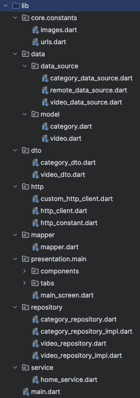

Date: 240404

> BottomNavigation
  - 들어가는 아이템은 2개 이상이어야 하고 라벨이 꼭 들어가야 에러가 안난다.
  - 3개 이상 추가시 하얗게 변하는 에러가 있는디
  ~~~dart
  // 요거를 추가해주면 된다.
   type: BottomNavigationBarType.fixed,
  ~~~

  - color는 직렬화/역직렬화가 되지 않는 클래스라 이러한 타입들은 freezed 쓸 때 주의해야함. 

> ClipRRect  
- 동그란 위젯 만들기 
> Container  
 - decoration을 작성하면, 컨테이너의 색상은 decoration 안에서 설정해야하고, container 밖에 color는 작성하면 안된다.  
 - row나 column 안에서 container는 크기가 있어야 한다.  
 - pageView를 사용해서 가로 스크롤에 children을 구현 할 수 있다. sizedBox로 감싸서 크기 조절 가능.  
    container로 감싸지 않는 이유는, 생성자가 일반 생성자인데, sizedBox는 const 생성자여서 메모리 활용하기 좋다.  
 - 
>  List.generate
> GridView
- shrinkWrap : true // 스크롤 없애기. 성능은 안좋지만 신경쓰지 말 것. 컬럼처럼 동작하게 함.
- physics: const NeverScrollableScrollPhysics() // 스크롤 안되게 

- 컬럼은 차일드를 그대로 뿌리는데, 리스트뷰는 칠드런 사이즈를 몰라서 안보인다.
  - 해결법은 shrinkWrap을 쓰거나 Expanded
  - 
- meterial3 - navigationBar
> 위젯 vs 헬퍼
- 위젯
   - 불변객체
   - 따로 stf/stl 클래스를 만들어서 사용한다.
- 헬퍼는 일반 메소드. 
  - 내용이 const냐 아니냐에 따라 매번 새로 메소드를 생성.
  - 함수 형태

---- 
> 디버깅 노트

- 앱 바 내용물을 위젯으로 빼려고 했더니 PreferredSizeWidget을 with 해주는 곳에서 자꾸 에러가 났다.
size를 오버라이딩 했는데도 에러가 사라지지않아서 봤더니... dart3부터 implements로 바뀐 것...😞
~~~dart
class MyAppBar extends StatelessWidget implements PreferredSizeWidget {
  ...
}

// In Dart 3, the rules around mixins have been made stricter compared to previous versions. As mentioned in the release notes, any class could be used as a mixin before Dart 3, as long as it had no declared constructors and no superclass other than Object. In Dart 3, classes declared in libraries at language version 3.0 or later can't be used as mixins unless they are explicitly marked with the mixin keyword.
//
// So, PreferredSizeWidget is not declared as a mixin and does not have the mixin keyword in its definition. This is why the error is encountered when using it as a mixin.

~~~

- 유튜브 클론 코딩 프로젝트 
  - [> 깃헙에 코드 보러가기](https://github.com/somarok/youtube_clone_coding)
  - 폴더 구조 :  데이터 소스 > 레포지토리 > 서비스 > 화면    
    
  - 구조를 짜는데 많은 고민을 했다. 데이터 폴더를 도메인 별로 나눠야 할지, 화면 별로 나눠야 할지..
    데이터를 기준으로 정리를 해야 할지 모호함의 연속이었다.   
  - 유튜브 API를 활용하여 데이터를 호출하고 UI에 그려주었다.    
    
    
  - https://console.cloud.google.com/projectselector2/apis/dashboard 에서 새 프로젝트를 추가하고
  - 검색 > YouTube Data API v3 클릭 > 사용 클릭 
  - 사용자 인증 정보 > 사용자 인증 정보 만들기 > API 키 > 키 별도 저장 후
  - API키를 수정하세요 클릭 > 키제한 > YouTube Data API v3 선택
  API url
  https://www.googleapis.com/youtube/v3/videos?part=snippet&chart=mostPopular&maxResults=25&regionCode=kr&key=API키
