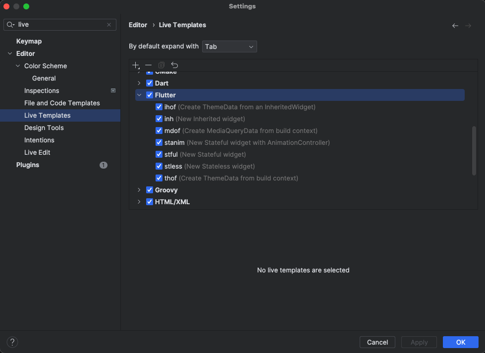
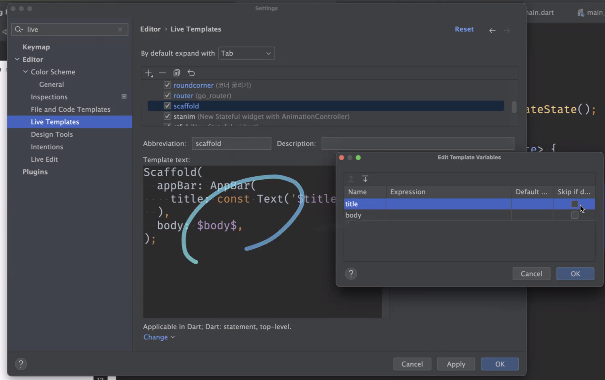
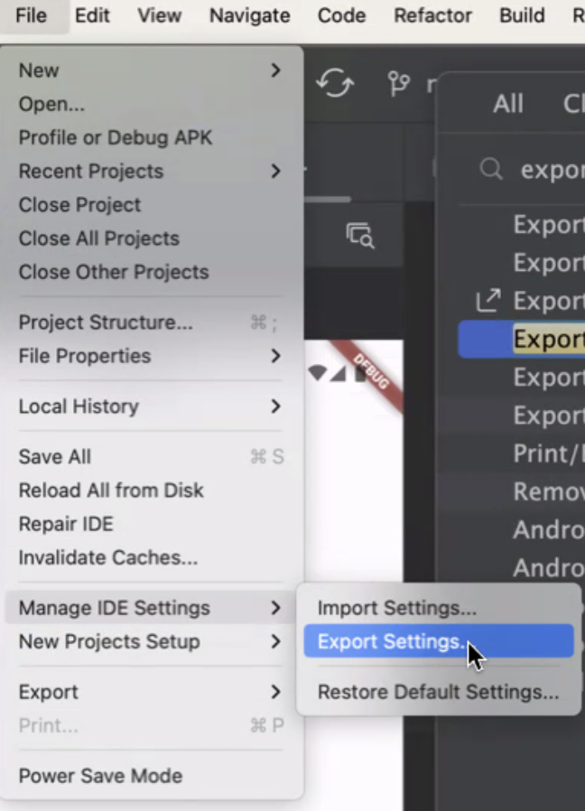
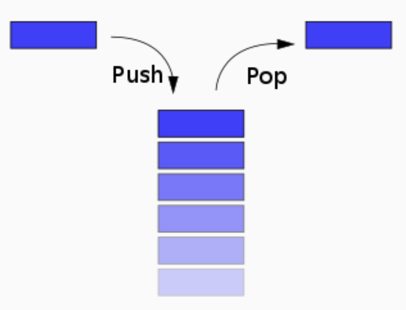
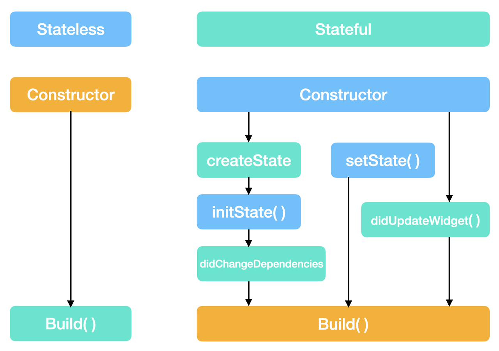
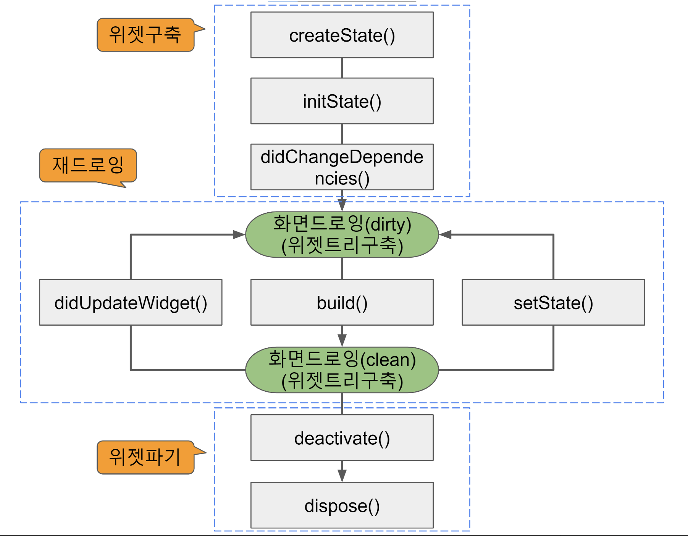
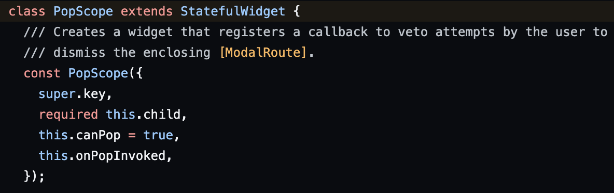

Date: 240405

- SafeArea
  - 디바이스 노치같은거 영역에 가리지 않게 도와주는 위젯
> 라이브 템플릿
- 생산성 향상 시키기

  

  
 안드로이스 스튜디오 라이브 템플릿 설정하는 방법 
  

  

  

  - 라이브 템플릿 백업

  

  
  

- vsCode 사용 시에는 비슷한 기능으로 스니펫을 사용할 수 있다.
 
[vsCode 용 snippet 참고](https://jojoldu.tistory.com/491)

---- 
> FutureBuilder

- State의 build 안에서는 데이터 요청 절대 금지
- initState() 는 생성자 느낌. 화면 그리는 초기에 한 번 실행된다.
  ~~~~dart
  void initState(){
      todoRepo.getTodos().then((todos){
          setState(){
              ...
          }
      })
  }
  ~~~~
- snapshot으로 연결 됐는지 알 수 있음
  ~~~dart
  FutureBuilder<List<Video>>(
          future: _getVideos(),
          // 파라미터 타입 생략 가능
          builder: (BuildContext context, AsyncSnapshot<List<Video>> snapshot) {
            switch(snapshot.connectionState){
              
              case ConnectionState.none:
                // TODO: 에러처리
              case ConnectionState.waiting:
                // TODO: 로딩처리
              case ConnectionState.active:
                // TODO: 
              case ConnectionState.done:
                // TODO: 데이터 핸들링
            }
        }
  )
  ~~~
  - FutureBuilder 속 FutureBuilder 는 콜백지옥 같은 문제가 생길 수 있음.  
  
    
  

>Navigation
- 화면 전환을 말한다.
- 화면 표시는 Stack 구조로 관리된다.

- push : 화면 전환 | pop : 되돌아오기
- 
- 다른 화면에 데이터 전달하기 위해서는 받을 화면 클래스의 생성자에 데이터 파라미터를 추가한다.
  그리고 push()에서 생성자로 데이터를 전달한다.
  ~~~dart
    MeterialPageRoute(builder:(context) => AdDetailPage(ad: ad))
  ~~~
- 데이터 돌려받기  
  push() 함수 자체가 future를 리턴하는 타입.
  Navigator.pop(context, data);  

- 라우터 사용
  - 중규모 이상 플젝에서는 go_router 패키지를 사용. 웹 지원시에는 무조건 사용한다.  
  - 웹페이지 같은 주소 체계를 지원.
  - deep link 지원.

  ~~~dart
    bool? result = await context.push<bool?>('/photos');

    /// 위와 같은 함수
    bool result = await Navigator.push(
      context,
      MaterialPageRoute(builder: (context) => const PhotoListScreen()),
      ) ?? false;    
  ~~~

  - go() 함수는 완전 스택 교체. 페이지가 쌓이지 않음. 앱에서는 push만 쓰는걸로.
  - RestFul 한 주소 체계를 지원함
  - queryParameter를 보낼때는 String으로 값을 보내야한다. 그렇게 안하면 받을 때 터짐.
  - jsonEncode해서 객체를 보내고, jsonDecode 해서 객체를 역직렬화 해야 함.
  - push로 주고받을 때는 데이터 모델 객체 보낼 수 있음. 한개만 가능.  
    두 개 보내고 싶으면? => 리스트로 보낸다.  
    주고 받을 때는 타입에 대한 서로 신뢰가 있다고 가정하고 간다. 

   

> ### **StatefulWidget의 생명주기**

   
 
[화면구축]
- createState()  
statefulWidget을 구축하자마자 호출된다.  
statefulWidget에 반드시 존재해야 한다.  
위젯 트리에 상태를 만들기 위해 호출된다.

- initState()  
위젯 트리 초기화를 한다.  
위젯이 생성될 때 호출되는 메서드이다.    
state를 초기화 해주는 역할이며, 최초 한번만 호출 된다.    

- didChangeDependencies()  
state 객체의 종속성이 변경될 때 호출된다.    
initState뒤에 호출되지만 그 이외에도 호출.  
위젯이 최초 생성된 후, initState() 다음에 바로 호출된다.  
위젯이 의존하는 데이터의 객체가 변경될 때마다 호출된다.  

[재 드로잉]
- build()  
위젯으로 만든 UI를 구축. 가장 많이 호출된다.  
다양한 곳에서 반복적으로 호출  
변경된 부분 트리를 감지하고 대체  
이곳에 계산이 필요한 로직이 많이 있다면 앱의 성능은 낮아진다.  
반드시 존재해야하고, 재정의(override) 대상이다.
반드시 Widget을 반환해야한다.

- didUpdateWidget()  
위젯의 구성이 변경될 때마다 호출  
부모 위젯이 변경되고 다시 그려져야 할 때 호출  
oldWidget 인수를 취득해 비교. 이전 상태의 자신을 받는다.  

- setState()  
내부 상태가 변경되었음을 프레임워크에 알려주고, build()가 호출된다.  
만약 setState()를 사용하지 않고 값을 변경시키면 UI에 변경데이터가 반영되지 않는다.

[화면 파기]
- deactivate()  
state 오브젝트가 트리로부터 삭제될 때마다 호출  

- dispose()  
객체가 트리에서 완전히 삭제되고 두 번 다시 빌드되지 않으면 호출  
사용되었던 것들을 영구적으로 제거할 때 사용한다.  
제거해주지 않으면 메모리 누수가 발생해 앱의 성능이 떨어진다.  

---- 
> 디버깅 노트

-  WillPopScope 가 Deprecated 된 일에 대하여...
   -  왜 Deprecate 된 걸까?  
   안드로이드 14(API Level 34)부터 Predictive Back Feature(ahead-of-time model)가 도입될 예정이며, 그에 따라 호환되지 않는 기존의 플러터 내비게이션 API (WillPopScope, Navigator.willPop)는 Deprecated 되었다.
   이 Predictive Back Feature는 사용자의 제스쳐가 어떤 동작을 하게 될 지 미리 보여주는 기능인데,  
   안드로이드 14부터는 하단에 존재하던 세개의 소프트 키 대신 이 기능이 기본 셋팅이 될 것으로 보인다.  
   따라서 하단 백버튼 동작을 핸들링 하도록 만들어진 WillpopScope 함수 대신 PopScope가 대안책으로 마련되었다.  

 

  - canPop()
뒤로가기 동작을 제어하는 boolean 타입 파라미터
default value는 true이며, true일 경우 뒤로가기 동작이 평소처럼 실행된다는 것을 의미하며 false일 경우 뒤로가기 동작이 비활성화된다.
WillScopePop에서 onWillPop으로 화면을 바로 pop 하는게 아니라, canPop의 인자로 boolean 값을 보내면서 pop 될지 말지의 여부를 미리 정한다.  

- onPopInvoked()
성공 여부에 관계 없이 뒤로가기 동작이 발생했을 때 호출되는 콜백 함수
canPop이 false여도 onPopInvoked는 여전히 호출되며, didPop은 false.  
(Pop에 실패했을 때도 false) 반면 canPop이 true면 didPop도 true.
[> 공식문서 참고](https://docs.flutter.dev/release/breaking-changes/android-predictive-back#migration-guide)

---- 

 
