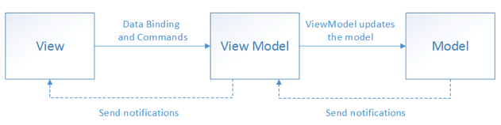

Date: 240408

- initState() 안에서 Future 함수를 쓰고싶다면 별도로 함수를 작성한 후 호출한다.
~~~dart
@override
  void initState() {
    super.initState();
    getList();
  }

Future<void> getList(){}
~~~

> Hero
- goRouter를 쓰면 리스트에서 상세로 넘어갈 때 Hero 애니메이션이 안먹음. navpush 를 써야함..

> # Changenofifier
- Changenofifier 뭐냐 넌?  

   > A class that can be extended or mixed in that provides a change notification API using VoidCallback for notifications.
    It is O(1) for adding listeners and O(N) for removing listeners and dispatching notifications (where N is the number of listeners).
        
    > 변경 알림 API를 제공하는 클래스로, 알림에는 VoidCallback을 사용합니다.
    추가된 리스너는 O(1) 시간복잡도로, 제거 및 알림 전달은 O(N) 시간복잡도를 가집니다.
    (여기서 N은 리스너의 수입니다).

    알림을 위해 VoidCallback을 사용하여 변경 알림 API를 제공하는 확장 또는 혼합이 가능한 클래스.   
    리스너를 추가하는 경우 O(1)이고 리스너를 제거하고 알림을 전달하는 경우 O(N)입니다(여기서 N은 리스너 수).
    데이터 구조는 ChangeNotifier 에서 확장하거나 혼합하여 Listenable 인터페이스를 구현할 수 있으므로 ListenableBuilder 와 같이 Listenable 에 대한 변경 사항을 수신하는 위젯과 함께 사용할 수 있다.

    ----

   
- ChangeNotifier with 해서 class를 만들면 뷰 모델의 역할을 하게 되는 셈인 것 같다.
- 뷰에서 이 ChangeNotifier를 전달해서 뷰 안에 그려질 UI depth에 구애받지 않고 화면에 전체적으로 사용되는 값이나 로직을 핸들링 할 수 있다.
- ChangeNotifier를 구현한 클래스 내부 함수에 notifyListener()를 달아주면 이 함수가 호출 될 때 마다 동작이 됨을 알 수 있게 된다.
그러면 뷰에서는 리스너를 선언한 함수가 동작했을 때 뷰를 어떻게 바꿀지 등의 처리 로직을 담은 함수를 ChangeNotifier에 add 해 주는 식으로 사용 할 수 있다.

  

- notifyListeners()  

notifyListeners() 이 메서드는 상태 변경을 알리는 데 사용된다. 
이 메서드는 _listeners 배열에 있는 각 리스너를 호출하고, 리스너가 예외를 throw하면 해당 예외를 처리하여 디버그 정보를 출력한다.

이 메서드는 _notificationCallStackDepth 변수를 사용하여 재귀적으로 호출되는 경우를 추적하고, 
모든 재귀 반복이 완료된 후에 _listeners 배열을 축소한다. 

이를 통해 메서드가 모든 재귀 호출을 완료한 후에만 _listeners 배열을 변경할 수 있다. 
추가적으로, _reentrantlyRemovedListeners 변수를 사용하여 재귀적으로 제거된 리스너의 수를 추적하고, 모든 알림이 완료된 후에만 해당 리스너들을 제거합니다.

~~~dart
@protected
@visibleForTesting
@pragma('vm:notify-debugger-on-exception')
void notifyListeners() {
  assert(ChangeNotifier.debugAssertNotDisposed(this));
  if (_count == 0) {
    return;
  }

  // To make sure that listeners removed during this iteration are not called,
  // we set them to null, but we don't shrink the list right away.
  // By doing this, we can continue to iterate on our list until it reaches
  // the last listener added before the call to this method.

  // To allow potential listeners to recursively call notifyListener, we track
  // the number of times this method is called in _notificationCallStackDepth.
  // Once every recursive iteration is finished (i.e. when _notificationCallStackDepth == 0),
  // we can safely shrink our list so that it will only contain not null
  // listeners.

  _notificationCallStackDepth++;

  final int end = _count;
  for (int i = 0; i < end; i++) {
    try {
      _listeners[i]?.call();
    } catch (exception, stack) {
      FlutterError.reportError(FlutterErrorDetails(
        exception: exception,
        stack: stack,
        library: 'foundation library',
        context: ErrorDescription('while dispatching notifications for $runtimeType'),
        informationCollector: () => <DiagnosticsNode>[
          DiagnosticsProperty<ChangeNotifier>(
            'The $runtimeType sending notification was',
            this,
            style: DiagnosticsTreeStyle.errorProperty,
          ),
        ],
      ));
    }
  }

  _notificationCallStackDepth--;

  if (_notificationCallStackDepth == 0 && _reentrantlyRemovedListeners > 0) {
    // We really remove the listeners when all notifications are done.
    final int newLength = _count - _reentrantlyRemovedListeners;
    if (newLength * 2 <= _listeners.length) {
      // As in _removeAt, we only shrink the list when the real number of
      // listeners is half the length of our list.
      final List<VoidCallback?> newListeners = List<VoidCallback?>.filled(newLength, null);

      int newIndex = 0;
      for (int i = 0; i < _count; i++) {
        final VoidCallback? listener = _listeners[i];
        if (listener != null) {
          newListeners[newIndex++] = listener;
        }
      }

      _listeners = newListeners;
    } else {
      // Otherwise we put all the null references at the end.
      for (int i = 0; i < newLength; i += 1) {
        if (_listeners[i] == null) {
          // We swap this item with the next not null item.
          int swapIndex = i + 1;
          while (_listeners[swapIndex] == null) {
            swapIndex += 1;
          }
          _listeners[i] = _listeners[swapIndex];
          _listeners[swapIndex] = null;
        }
      }
    }

    _reentrantlyRemovedListeners = 0;
    _count = newLength;
  }
}
~~~

- addListener()
~~~dart
@override
void addListener(VoidCallback listener) {
  assert(ChangeNotifier.debugAssertNotDisposed(this));

  if (kFlutterMemoryAllocationsEnabled) {
    maybeDispatchObjectCreation(this);
  }

  if (_count == _listeners.length) {
    if (_count == 0) {
      _listeners = List<VoidCallback?>.filled(1, null);
    } else {
      final List<VoidCallback?> newListeners =
          List<VoidCallback?>.filled(_listeners.length * 2, null);
      for (int i = 0; i < _count; i++) {
        newListeners[i] = _listeners[i];
      }
      _listeners = newListeners;
    }
  }
  _listeners[_count++] = listener;
}
~~~

 _listeners 배열에 리스너를 추가하는 동작이 이루어집니다. 이 메서드는 리스너를 추가할 때마다 _listeners 배열의 크기를 동적으로 조정하여 더 많은 리스너를 수용할 수 있도록 합니다. 이것은 O(1) 시간 복잡도로 작동하는 것이 아니라, O(N) 시간 복잡도를 가지는 작업입니다. 왜냐하면 _listeners 배열을 복사하고, 크기를 두 배로 늘리는 작업이 반복되면서 수행되기 때문입니다.

- 내 추측 : Changenofifier를 사용하지 않는다면 복잡하고 다양한 데이터를 다루려고 할 때, 
그리고 뷰가 여러 클래스로 나뉘어져 있을 때 데이터를 계속해서 내려보내줘야하고 이는 수정시 코드 변경이 많이 일어나야 할 수 있다.

- ValueNotifier<T> class
    -  ChangeNotifier의 하위 클래스
    - setState() 없이 상태 값을 관리할 수 있다
    - 단일 값의 변경을 수신 대상에게 일릴 수 있는 기능 제공
    - 단순한 값의 변화를 감지하고 이를 수신 대상에게 알려줄 수 있다.
    - 값이 변경됨에 따라 내용을 표시할 뷰에 ValueListenableBuilder를 달아서 값 변경을 감지하도록 한다.
    뷰 모델에서는 ValueNotifier를 값 변경을 감지할 대상에다 선언해준다.
    ~~~dart
     final counter = ValueNotifier<int>(0); // 0은 초기값

    counter.value = 5;  // 값 변경 시 이렇게 사용
    ~~~
- TextEditingController 도 ValueNotifier 다
- 다음의 경우에 사용하길 추천
  - 여러 위젯에서 접근하기 때문에 setState 사용이 어렵다.
  - Provider와 GetX 같은 상태관리 툴을 무분별하게 사용하고 싶지 않다.
  - 오직 한 클래스의 변화에만 관심이 있다.

궁금한점 ? 다이얼로그 처럼 받은 값에 따라 화면을 표시하는 곳에서는 어떻게 해야할까. 레포지토리까지 필요하진 않은데 값의 변화를 듣고 뷰를 변경해야 할 경우에는? 어떻게 하지? => 뷰 모델을 통해서 값만 다룬다. 콜백 사용해서 다이얼로그 리빌드.

- Changenofifier는 어떻게 동등성 비교를 해서 remove 하는걸까?

---- 

상태 관리

MVVM을 구성하는 3가지 요소의 역할과 책임을 이해하기 위해서는 먼저 이들 사이의 관계를 알아야 합니다. 뷰는 뷰 모델을 알지만, 뷰 모델은 뷰를 알지 못합니다. 뷰 모델은 모델을 알지만, 모델은 뷰모델을 알지 못합니다.

이런 구조를 통해서 뷰 모델과 모델이 뷰로부터 독립적인 형태를 만들어서 위에서 말한 UI로부터 비즈니스 로직과 프레젠테이션 로직을 분리라는 목적을 이룰 수 있게 된 것입니다.

1. 뷰
뷰의 역할은 UI에 관련된 것을 다루는것 입니다. 사용자가 스크린을 통해서 보는 것들에 대한 구조, 레이아웃, 형태를 정의하는 것입니다. 뷰는 애니메이션 같은 UI 로직을 포함하되 비즈니스 로직을 포함하지 말아야 합니다. 즉,

2. 뷰 모델
뷰 모델의 역할은 뷰가 사용할 메서드와 필드를 구현하고, 뷰에게 상태 변화를 알리는 것입니다. (뷰는 뷰 모델의 상태 변화를 옵저빙한다.) 뷰 모델에서 제공하는 메서드와 필드가 UI에서 제공할 기능을 정의합니다. 하지만, 뷰가 이 기능을 어떻게 보여줄 것인지를 결정합니다.

일반적으로 뷰 모델과 모델은 일대다 관계를 형성합니다. 뷰 모델은 뷰가 쉽게 사용할 수 있도록 모델의 데이터를 가공해서 뷰에게 제공합니다. 예를 들어, 뷰에서 서로 다른 두 모델의 데이터를 활용한 데이터가 필요하다면 뷰에서 모델의 값을 조작해서 사용하는 것이 아니라, 뷰 모델에서 두 모델의 데이터를 가공하고 뷰에서는 오직 UI만 다루도록 해야 합니다.

[비즈니스 로직은 어디에 있어야 하나?](https://learn.microsoft.com/en-us/archive/msdn-technet-forums/3eb70678-c216-414f-a4a5-e1e3e557bb95)

[플러터 클린 아키텍쳐 참고 자료](https://medium.com/@yamen.abd98/clean-architecture-in-flutter-mvvm-bloc-dio-79b1615530e1)

