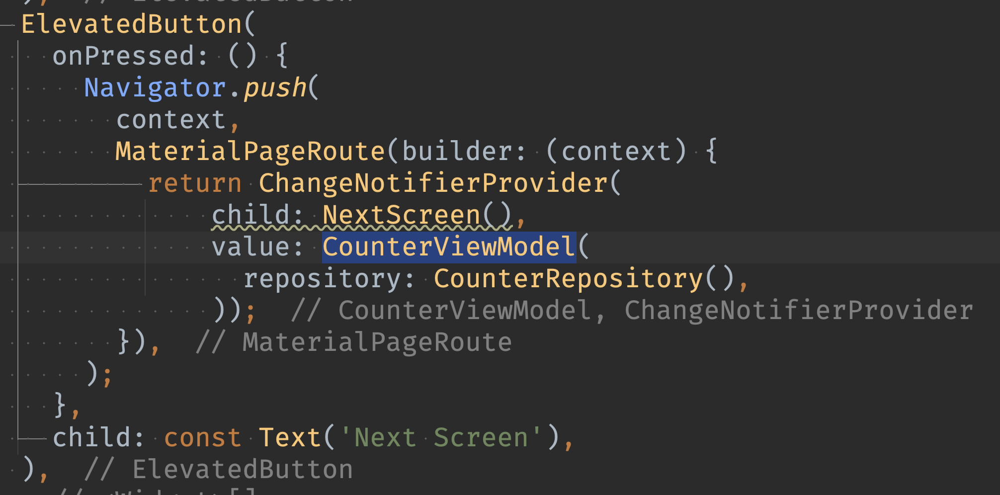

Date: 240409

- 지도는 구글맵을 사용하는게 가장 좋음.
- 다음 주소 API 라이브러리 : kpostal 
- Column 안에 List를 넣으면 안나옴. 
    - 나오게 하려면 shirinkWrap 
    - 한 컬럼에 List 두개 쓰려면 Expanded로 각각 감싸기

- List.unmodifiable() 쓰면 외부에서도 조작 할 수 없다.
  근데 코드 작성시엔 리스트 조작하려는 코드 써도 에러가 안남. 런타임에 에러 발생.
- 뷰모델에서는 함수를 유저의 동작으로 네이밍 하는 것이 좋음.
- MediaQuery.of(context).size; 디바이스 화면에 대한 정보를 가져올 수 있음
- Theme.of(context) : main 에서 설정한 테마 정보를 가져올 수 있음

---- 

>InheritedWidget

- 상태관리 근간이 되는 provider의 핵심이므로 잘 이해하도록 한다.
- 플러터는 트리 구조. 트리 중간에 뷰모델이나 레포같은 객체를 주기 워해서는 꼭대기에서부터 생성자를 통해 내려줘야 함.
  => 생성자를 통한 의존성 주입. 
  중간 단계는 필요가 없는 경우가 있음에도 불구하고 하단에서 쓰이기 때문에 전달해주기 위해 생성자에 파라미터로 추가해서 전달 해줘야하는 문제가 있음.
- 이 문제를 해결하기 위한 것이 InheritedWidget!
    - MediaQuery, Theme 이 대표적인 InheritedWidget이다.
    - XXX.of(context) 형태로 아무데나 쓰게 만들려면 InheritedWidget을 사용하면 된다.
    
- BuildContext : 위젯 트리의 정보를 알고있는 것. InheritedWidget을 사용하려면 context를 알도록 해야한다.
- context.dependOnInheritedWidgetOfExactType<MyColor>();
    -> 위젯 트리에서 위로 타고 올라가면서 가장 가까이에 있는 지정한 타입을 찾는 함수
- 맨 위에 꽂았지만 중간에서 바꿔주고 싶으면 중간에 또 꽂아줄 수 있음.
- initState에서 호출하면 안된다. context접근이 불가능. didChangeDependencies()에서 해야함.
- 다음 페이지 넘어갈때 이렇게 꽂아서 주게되면 다음 페이지에서는 새로운 뷰 모델을 생성해서 가지게 된다. 왜냐면 같은 트리가 아니라 다른 트리이기 때문.

- 같은 뷰 모델을 공유하고 싶다면 두 트리를 포함하는 상단에서 InheritedWidget을 꽂아줘야 한다.
- 일반적으로는 화면 하나당 하나의 뷰 모델을 쓴다.

[> 구글이 정리한 영상](https://youtu.be/og-vJqLzg2c?feature=shared)

 ~~~dart
 import 'package:flutter/material.dart';

void main() {

    /// 위젯 트리의 최상단에서 커스텀한 InheritedWidget로 감싸고 뷰모델을 넣어주었다. 
    /// 이제 하위 트리에서는 뷰모델에 접근이 가능하다.
  runApp(
    ChangeNotifierProvider<MyViewModel>(
      value: MyViewModel(),
      child: const MyApp(),
    ),
  );
}

class MyApp extends StatelessWidget {
  const MyApp({super.key});

  // This widget is the root of your application.
  @override
  Widget build(BuildContext context) {
    return MaterialApp(
      title: 'Flutter Demo',
      theme: ThemeData(
        colorScheme: ColorScheme.fromSeed(seedColor: Colors.deepPurple),
        useMaterial3: true,
      ),
      home: const MyViewModelTest(),
    );
  }
}

/// 커스텀한 InheritedWidget 위젯. 뷰 모델과 클래스를 파라미터로 받는다.
class ChangeNotifierProvider<T extends ChangeNotifier> extends InheritedWidget {
  final T value;

  const ChangeNotifierProvider({
    super.key,
    required super.child,
    required this.value,
  });

  static ChangeNotifierProvider<T> of<T extends ChangeNotifier>(
      BuildContext context) {
    return context
        .dependOnInheritedWidgetOfExactType<ChangeNotifierProvider<T>>()!;
  }

  @override
  bool updateShouldNotify(ChangeNotifierProvider oldWidget) {
    return value != oldWidget.value;
  }
}

class MyViewModel with ChangeNotifier {
  int _count = 0;

  int get count => _count;

  void increment() {
    _count++;
    notifyListeners();
  }
}

class MyViewModelTest extends StatefulWidget {
  const MyViewModelTest({super.key});

  @override
  State<MyViewModelTest> createState() => _MyViewModelTestState();
}

class _MyViewModelTestState extends State<MyViewModelTest> {
  @override
  Widget build(BuildContext context) {
    /// 최상단인 MyApp에서 ChangeNotifierProvider<MyViewModel>로 감쌌기 때문에 뷰 모델을 불러와 값을 사용 할 수 있다.
    /// 또한 다른 곳에서 뷰 모델을 공유할 수 있다.
    final viewModel = ChangeNotifierProvider.of<MyViewModel>(context).value;

    return Scaffold(
      appBar: AppBar(
        title: Text(viewModel.count.toString()),
      ),
      body: Center(
        child: Column(
          children: [
            ElevatedButton(
              onPressed: () {
                setState(() {
                  viewModel.increment();
                });
              },
              child: const Text('+'),
            ),
            ElevatedButton(
              onPressed: () {
                Navigator.push(
                  context,
                  MaterialPageRoute(builder: (context) => const NextScreen()),
                );
              },
              child: const Text('Next'),
            ),
          ],
        ),
      ),
    );
  }
}

class NextScreen extends StatefulWidget {
  const NextScreen({super.key});

  @override
  State<NextScreen> createState() => _NextScreenState();
}

class _NextScreenState extends State<NextScreen> {
  @override
  Widget build(BuildContext context) {
    
    final viewModel = ChangeNotifierProvider.of<MyViewModel>(context).value;

    return Scaffold(
      appBar: AppBar(
        title: Text(viewModel.count.toString()),
      ),
      body: Center(
        child: Column(
          children: [
            ElevatedButton(
              onPressed: () {
                setState(() {
                  viewModel.increment();
                });
              },
              child: const Text('+'),
            ),
            ElevatedButton(
              onPressed: () {
                Navigator.push(
                  context,
                  MaterialPageRoute(builder: (context) => const NextScreen()),
                );
              },
              child: const Text('Next'),
            ),
          ],
        ),
      ),
    );
  }
}
 ~~~
 
 > covariant 공변

~~~dart
class Animal {
  void chase(Animal x) { ... }
}

class Mouse extends Animal { ... }

class Cat extends Animal {
  @override
  void chase(covariant Mouse x) { ... }
}
~~~

- Animal 클래스를 상속한 Cat 클래스에서 오버라이드한 chase() 함수는 covariant 키워드를 사용했고, Mouse 클래스를 파라미터로 받고 있다.
부모 클래스에서는 이 함수의 파라미터가 Animal 클래스로 되어있지만, Animal 클래스를 상속한 특정 클래스만 파라미터로 받고 싶을 경우,
covariant 키워드를 붙이면 원하는대로 사용 할 수 있다.

- 부모 class에 covariant 가 적용되어있을 때 상속 혹은 구현하게 될 경우 자식 class는 covariant 를 사용하지 않고도 타입을 변경할 수 있다.
- 부모가 covariant num으로 작성되어 있는 경우 자식은 해당 타입의 자식으로도 변경이 가능하다.
- 자식 클래스는 부모의 부모 클래스의 매개변수 타입으로도 설정할 수 있다.

예제코드

~~~dart
main() {
  ChildA().read("aaa");
  ChildB().read(1);
  ChildC().read(1.0);
}

class GrandParent {
  read(Object l){
    print(l);
  }
}

class ParentA extends GrandParent {
  @override
  read(covariant num l) {
    print(l);
  }
}

class ChildA extends ParentA{
  @override
  read(Object l) {
    print(l);
  }
  
}
  
class ChildB extends ParentA{
  @override
  read(int l) {
    print(l);
  }
}

class ChildC extends ParentA{
  @override
  read(double l) {
    print(l);
  }
}

class ChildD extends ParentA{
}

class ParentB extends GrandParent {
  @override
  read(Object l) {
    print(l);
  }
}
~~~

 ----
 > 앱 배포하기
 - 앱 아이콘 준비
 appicon.co