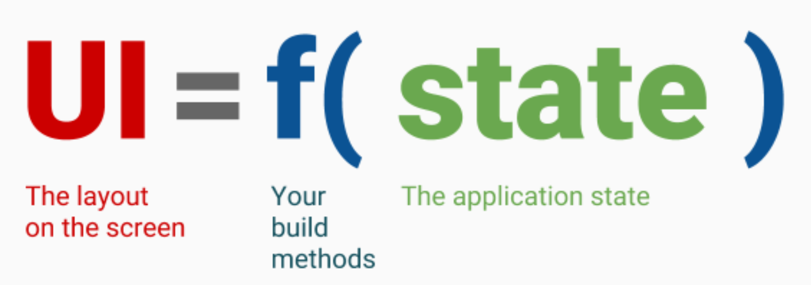
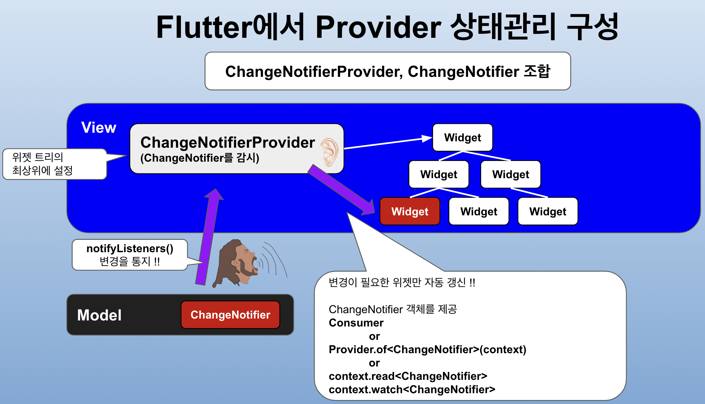
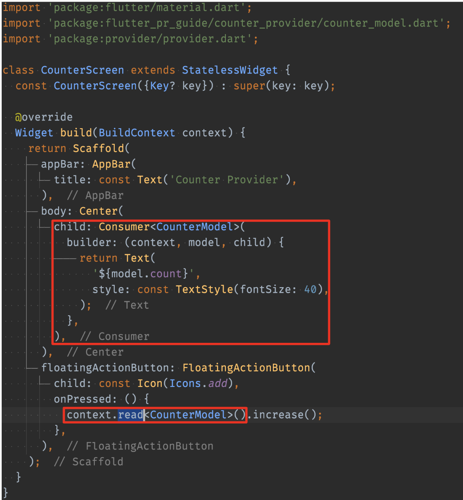

Date: 240411

> 상태관리
- 상태 = 데이터 = 변수
- 변수를 수정하면 알아서 바뀌게 하자 
- = InheritedWidget + (ValueNotifier 또는 ChangeNotifier)

  - 함수에 상태를 넣으면 UI가 뿅 

  

> 상태의 종류에는 뭐가 있을까?
- 임시 상태
  - pageView의 index
  - BottomNavigationView의 index
  - 애니메이션 상태  

  

- 그 외, 어플리케이션 상태
  - preference
  - 로그인 정보
  - 쇼핑몰의 카트
  - 메일앱의 읽은 메일/ 안 읽은 메일
  - 소셜앱의 알림 

> 상태관리 라이브러리 4대장
- Provider  ✅
  - inheritedWidget 을 직접 작성하는 것 대신 사용할 수 있다. 가장 흡사하며 근본과 가깝다. 
  - 구글에서 밀고 있음
  - 제약이 많다 = 에러 내기 어렵다.
- GetX
  - 상태관리 라이브러리 중 마약.. 쓰면 쓸 수록 후폭풍이 엄청날 것.
  - 잘못된 아키텍쳐로 갈 수 있는 여지가 크다.
  - GetX를 꼭 쓰고 싶다면.. 데이터 단에서는 절대 쓰지 않는 걸로 하자
- Riverpod  ✅
  - 현재 가장 트렌디한 라이브러리.
  - 사용하면 뷰모델이 사라짐. 리버팟 패턴이 됨. 
  - 유지보수 측면에선 썩 좋진 않을 수 있음.
  - top level에 모두 정의해 놓고 어디든 가져다 쓰는 개념.
  - 코드 제네레이션 기법을 사용해 런타임에러를 없앴다.
- Bloc
  - 처음 구글에서 밀어주던 정통적인 상태관리 라이브러리. 
  - 아직도 매니아층이 존재하며 RxDart, Stream 등의 지식이 필요해 러닝커브가 좀 있다는 단점.
  - 대형 플젝 위주로 쓴다.

- June? - BrandNew

>ChangeNotifierProvider

1. 관찰 대상 객체 생성 => class ViewModer with ChangeNotifier{}
2. 프로바이더 의존성 추가 => flutter pub add provider
3. ChangeNotifier 제공할 부분에 ChangeNotifierProvider 위젯으로 감싸기
    ~~~dart
    void main(){
        runApp(
            ChangeNotifierProvider(
                create:(context) => ViewModel().
                child: const MyApp(),
            ),
        );
    }
    ~~~
4. 뷰 모델 선언 시
    ~~~dart
    /// watch() 는 지속적인 관찰을 하고 변경시 build() 를 리빌드 함. build() 메서드 내에서 사용
    @override
    Widget build(BuildContext context){
    final viewModel = Provider.of<뷰모델 타입>(context); // 예전 방식.
    final viewModel = context.watch<뷰모델 타입>(); // 바뀐 방식.
    }

    // 단발성 접근시(뷰 모델 속 값이나 함수를 사용 할 때)
    context.read<뷰모델 타입>().increase();
    Provider.of<ViewModel>(context, listen:false).increase(); // 위와 같은 코드 예전 방식.(legacy)

    // initState()에서 뷰 모델을 부르고 싶다면 Futrue.microTask() 를 써서 호출한다.
    Future.microtask((){
    final viewModel = context.read<CounterViewModel>();
    ›viewModel.incrementCounter();
    });

    ~~~

- statelessWidget은 컨텍스트 접근 불가. 컨텍스트가 필요한 함수를 쓰려면 build 안에서 써야 한다.
- 화면이 시작하면서 미리 동작해야하는 부분이 있으면 stfWidget을 사용해야 한다.
- 위젯 트리 안에서는 watch 호출 불가.

- consumer 
    - UI를 자주 빨리 많이 바꿔서 그려야하는데 성능을 좋게 하기 위해 전체 리빌드를 하기 보다는 해당 부분만 바뀌도록 할 때 사용한다. 
    
     
> 앱 만들기 총정리
1. 새 프로젝트 생성
2. 필수 라이브러리 추가
- freezed
- collection: ^1.18.0
- intl: ^0.18.1
- http: ^1.2.1
- xml2json: ^6.0.0
- csv: ^6.0.0
- freezed_annotation: ^2.4.1
- json_annotation: ^4.8.1
- lottie: ^3.1.0
- shared_preferences: ^2.2.2
3. 폴더 구조
- data
    - data_source
        - api interface (http Client)
        - photo_data_source
    - dto
        - photo_result_dto
    - mapper
        - photo_mapper (ToPhoto on Hits)   
    - model
        - photo
    - repository            
        - photo_repository
        -- photo_repository_impl  => data source 인스턴스 선언
- presentation
    - search_list
        - serach_list_screen
        - search_list_view_model (with ChangeNotifier)
    - photo_detail
        - photo_detail_screen  

- dto > model > datasource  > repo  > vm > mapper

----
> 궁금한 점

- 다른 화면에서도 공통적으로 쓰는 위젯은 어떤 폴더에 놓을까?
=> 공통 폴더를 따로 뺄까?
- 분리한 위젯에서 뷰 모델을 생성자로 받도록 해야하나?   
=> 노! 값만 받도록 한다. 뷰모델은 절대로 넘기면 안된다. 스크린 단에서 끝나야 함.  
- 화면단에서는 await쓰지 않고 호출만 하도록 한다.

