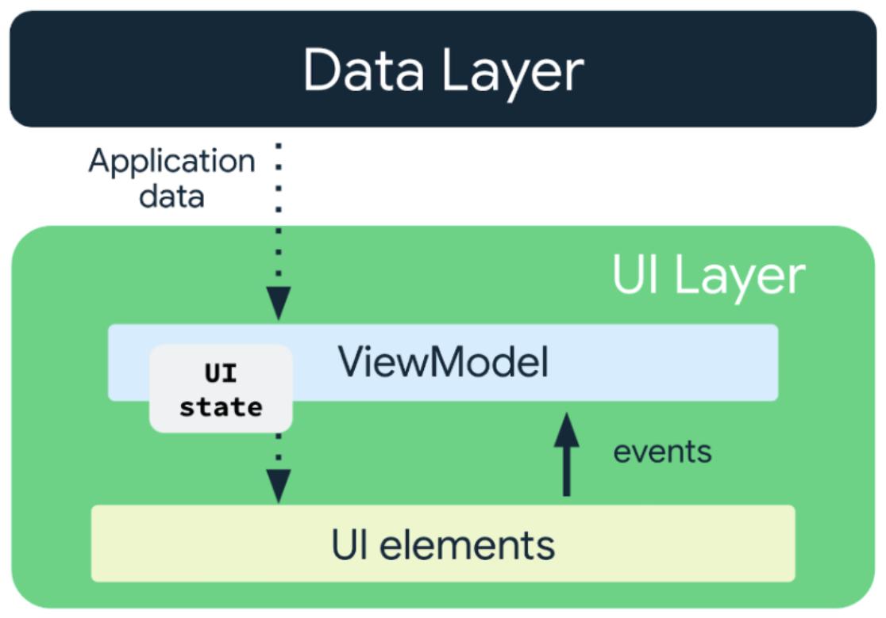
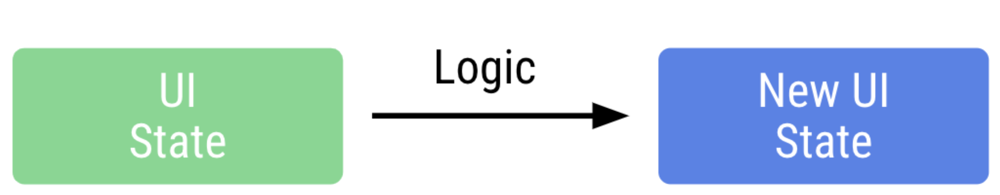
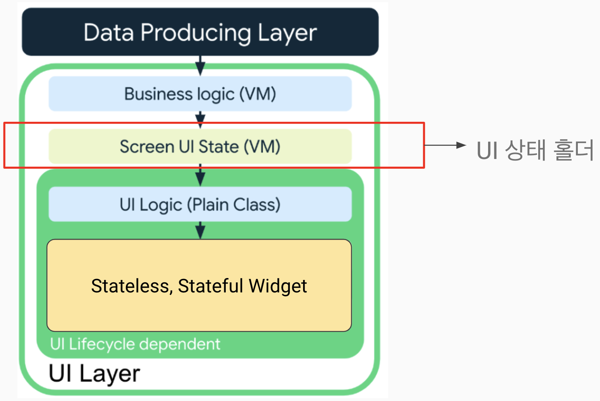
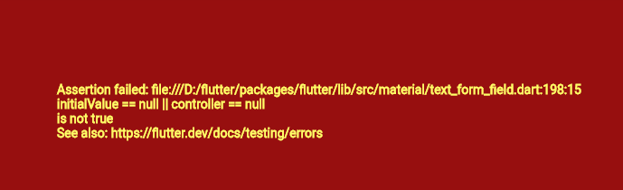

Date:240412

- 이제 안드로이드 출시할 때 실제 기기가 있어야 함.

--- 
>상태 모으기

- UI 상태의 두가지 유형
  -  스크린 UI state
    UI를 표시하기 위한 데이터들 (뷰 모델의 변수들)
  - UI element state
    위젯들의 상태를 관리하는 요소들 (TextEditingController 등)
- UI 상태는 정적인 속성이 아니다. 변수다.

- 시간이 흐름에 따라 사용자 액션에 따라 변경되며 그 로직은 뷰모델이 담당한다.

> 로직의 종류
- 수명주기와 무관
  - 비즈니스로직 : viewModel 메서드
  - 화면 UI 상태 : viewModel 변수
- 수명 주기에 종속
  - UI 로직 : 위젯 내부의 로직

>UI 레이어 로직 적용 흐름

- 관리해야 할 상태가 많이 생긴다. 
=> 개선방법 : UI 상태 홀더를 만들자
> UI 상태 홀더
- UI 표현을 위한 상태를 저장하는 클래스
- state 또는 UI State 클래스 라고 부르자.

>UI 상태 홀더의 책임
- 간단한 UI, 유지관리 ,테스트 가능성, 가독성

> 상태 홀더 클래스의 위치
- freezed를 사용한다.
- state 클래스를 따로 뺀 후 뷰 모델에 이 클래스 인스턴스를 선언해준다.

> 정리  

- 화면 하나에 하나의 UI 상태 홀더를 가지도록 한다 
- 일반적으로 ViewModel 에서 처리한다
- 상태 홀더가 반드시 필요한 것은 아니다. 간단한 UI 는 간단히 처리하자
- ViewModel은 전체 화면에서만 사용해야 한다
- ViewModel의 인스턴스를 하위 UI 요소에 전파하지 않는다. 이렇게 되면 UI 재사용성도 떨어지고 테스트 불가. 디버깅도 어렵다

--- 
미러링 앱 : vysor

>VSCode에서 자동완성 생성하기
- code > 기본 설정 > Configure User Snippet
- [> 코드를 snippet으로 변환해주는 사이트](https://snippet-generator.app/?description=view+model+state&tabtrigger=vmstate&snippet=%241+_state+%3D+const+%241%28%29%3B%0A%0A%241+get+state+%3D%3E+_state%3B&mode=vscode)

~~~dart
 // 스니펫 이름
 "freezed DataClass": {
			"prefix": "dataclass", // 사용할 축약어
			"body": [
				"import 'package:freezed_annotation/freezed_annotation.dart';",
				"",
				"part '$1.freezed.dart';",
				"",
				"part '$1.g.dart';",
				"",
				"@freezed",
				"class $2 with _$$2 {",
				"  const factory $2({",
				"    $0",
				"  }) = _$2;",
				"  ",
				"  factory $2.fromJson(Map<String, Object?> json) => _$$2FromJson(json); ",
				"}"
			],
			"description": "freezed DataClass snippet" //설명
		},
~~~

----
> 궁금한 점
- 프로바이더의 목적?
    - 생성자 매번 주입하는 것 삭제 + setState()를 대신 해주는 것.
    - inheritied widget 으로 하면 귀찮으니깐
    - goRouter가 프로바이더의 역할들을 많이 덜어가서 프로바이더의 이점이 더욱 두드러지지 않아보임.
    - 사실 프로바이더는 안써도 되긴 함 ㅋ
     
- C 페이지에서 어떤 동작 후 A 페이지로 와서 C 페이지의 상태 변수의 변화에 따른 처리를 하고자 한다면, 
이 두 트리의 상단에서 뷰모델을 선언해줘서 state 속 상태값을 꺼내서 처리해야 하나?

- 겟잇 - 인젝터블

>디버깅 노트
- TextFormField 사용시 에러

initialValue와 controller 둘중 하나는 null 이어야 한다는 내용.
TextFormField에 TextEditingController를 추가할때 initialValue를 주면 안된다.
~~~dart
/// 이렇게 컨트롤러에 초기값을 주는 것으로 변경함.
  @override
  void initState() {
    nameController = TextEditingController(
        text: widget.ingredient.name.isEmpty ? '' : widget.ingredient.name);
    weightController = TextEditingController(
      text: widget.ingredient.weight == 0
          ? ''
          : widget.ingredient.weight.toString(),
    );
    super.initState();
  }
~~~

 - IconButton 위젯
   - 터치가 가능한 오브젝트에 대해서 한 면이 최소 48px의 길이를 가져야 한다는 룰이 적용되기 때문에 기본 패딩이 잡혀있다.
   - padding 값을 zero로 설정해도 없어지지 않는다.
   

   
해결방안

   ~~~dart
    // 해결방안 1
    IconButton(
          padding: EdgeInsets.zero, // 패딩 설정
          constraints: BoxConstraints(),
          onPressed: () {},
          icon: Icon(Icons.info_outline),
        ),

    // 해결방안 2 : Icon 위젯을 따로 빼서 사용했다. 어차피 터치 영억을 텍스트 위젯까지 더 넓게 잡아줄거라서.
    Row(
        children: [
          GestureDetector(
            onTap: () {},
            child: const Row(children: [
              Text(
                '기준',
                textAlign: TextAlign.center,
              ),
              SizedBox(width: 3),
              Icon(
                Icons.info_outline,
                size: 20,
                color: Colors.grey,
              ),
            ]),
          ),
        ],
      )
   ~~~
   
   

   

