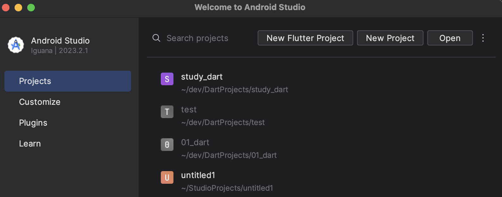
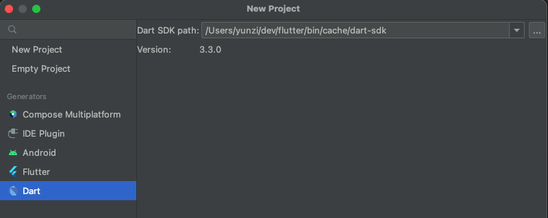
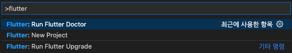

># Mac M2에서 플러터 설치 및 환경변수 설정하기

1. 안드로이드 스튜디오 또는 VSCode 설치\
   [안드로이드 스튜디오 다운로드](https://developer.android.com/studio?hl=ko&_gl=1*92fsnx*_up*MQ..*_ga*MTc4MDYyMDUyNy4xNzA5NjQ3NTY5*_ga_6HH9YJMN9M*MTcwOTY0NzU2OS4xLjAuMTcwOTY0NzU2OS4wLjAuMA..)\
    [VSCode 다운로드](https://code.visualstudio.com/download)

2. 플러터 SDK 설치\
   [플러터 SDK 다운로드](https://docs.flutter.dev/get-started/install) 

3. 플러터 환경 변수 등록\
   zsh가 기본 셀일 경우(macOS 카탈리나 이상)
    ~~~
    $vi ~/.zshrc
      파일 열리면 i 눌러서 insert 모드로 변경, 아래 코드 붙여넣기
    export PATH="$PATH:/XXXX/XXXX/XXX/flutter/bin" 
        esc 눌러서 모드 변경 후 :wq 타이핑 후 엔터키 눌러 빠져나오기
    $source ~/.zshrc 

    ~~~

    - :wq 는 저장하고 나간다는 뜻
    - source 명령어는 파일 변경사항 적용시키는 것
    - $PATH: 뒤에 붙는 주소는 자신이 플러터SDK를 다운받아서 설치 한 폴더의 주소를 넣는 것   

4. 플러터 SDK 설치 확인\
    터미널을 켜고 다음 명령어 입력
    ~~~
    $flutter doctor -v
    ~~~
    [!]가 표시된 항목이 있다면 해결해줘야함.\
    대표적인 이슈
    - [!] Android toolchain\
    다음 명령어를 이용하여 해결
        ~~~
        $flutter doctor --android-licenses
        ~~~
    
   
5. 플러터 플러그인 설치 및 설정
- 안드로이드 스튜디오 일 때
   - 안드로이드 스튜디오 실행 > Configure > Plugins > flutter 검색해서 install
   - 플러터 플러그인 설치 후 Dart 플러그인을 설치 할 지 물어보는 창이 뜨면 'yes' 클릭하여 설치
  
 - VSCode 일 때
   - 확장(시프트+커맨드+X)버튼 클릭 (좌측 네모블럭 아이콘) > flutter 검색 후 설치 & dart 검색 후 설치
  
6. 새 프로젝트 만들어보기
- 안드로이드 스튜디오\
 New Flutter Project 선택
    

  Dart 선택 > 플러터 설치된 폴더의 dart-sdk 폴더 경로 넣어주기
    

- VSCode\
  command+shift+p > flutter 검색 > Flutter:New Project > Application > 프로젝트 폴더를 만들고싶은 경로 선택
  
- 

