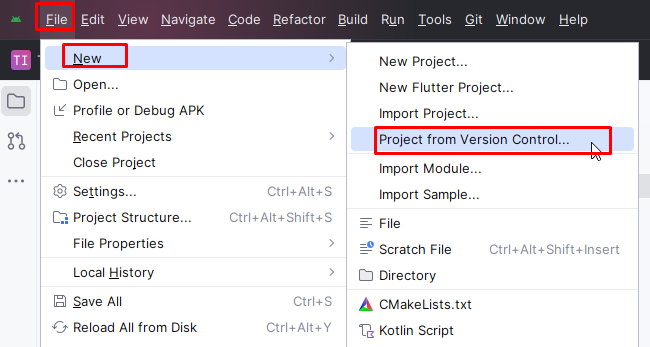

# git 최초 글로벌 설정
- git config --global user.name "이름"
- git config --global user.email "이메일주소"

## 글로벌 설정 확인
- git config --list (전체 조회)
- git config --global --list (글로벌설정만 조회)

## 안드로이드 스튜디오 깃허브 연결
- 토큰 연결
