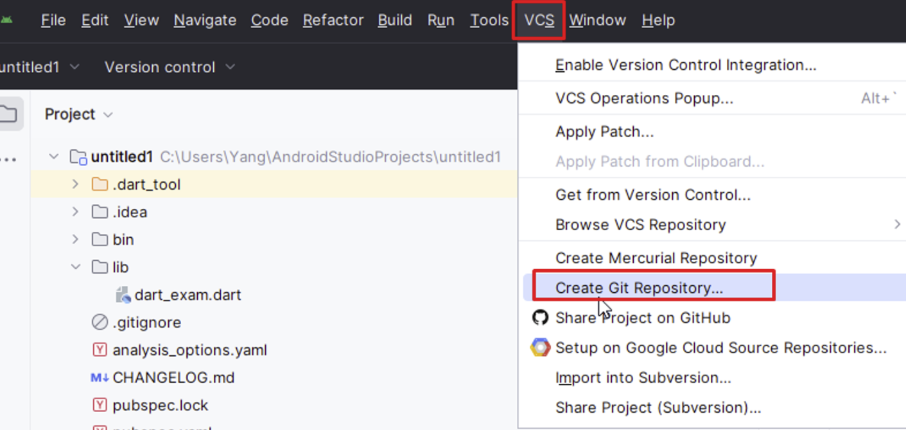
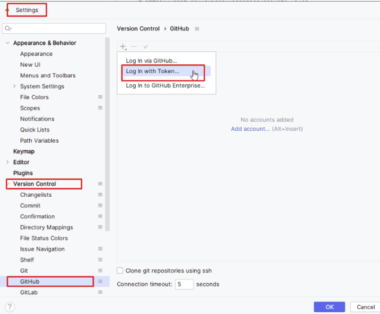
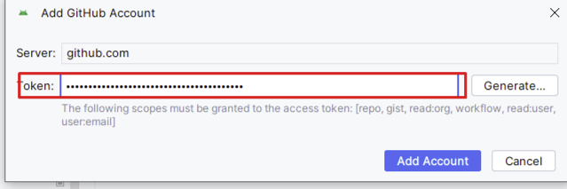
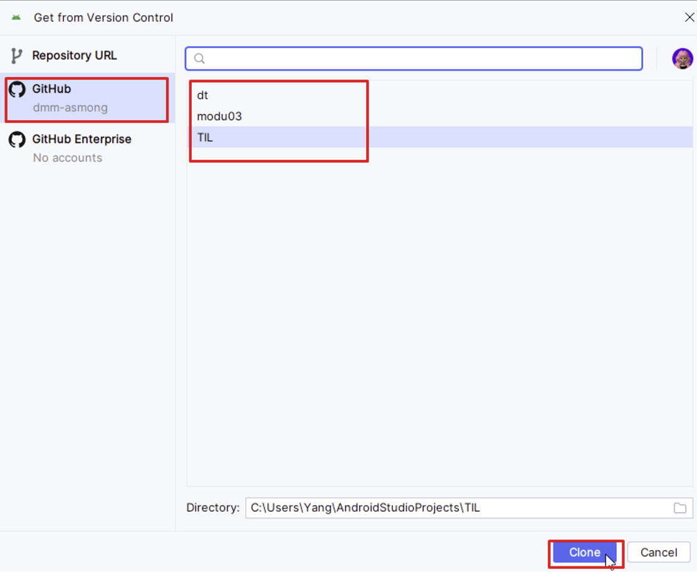

## 안드로이드 스튜디오 github 연결

## 안드로이드 스튜디오 github 클론하기

- 클론하면 내 컴퓨터(로컬)에 동일하게 복사되어 저장됨.
- 파일 수정 및 추가, add, commit, push 까지 하면 내 로컬 → origin(깃허브서버)/main(내꺼)으로 올라가서 저장됨.
(단, 이 과정이 꼬이지 않도록 주의)

## Flutter dart 문법
- 정수(int), 실수(double), 숫자(num) : 정수(int)와 실수(double)의 더 큰 범위가 숫자(num)
예) int a = 10;
    double b = a; //에러남
