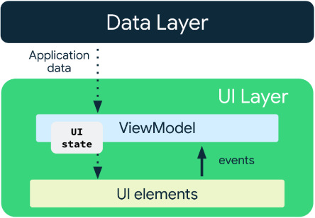
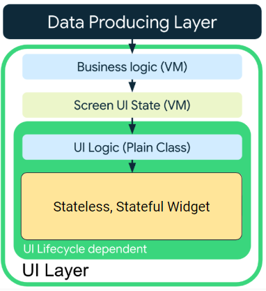
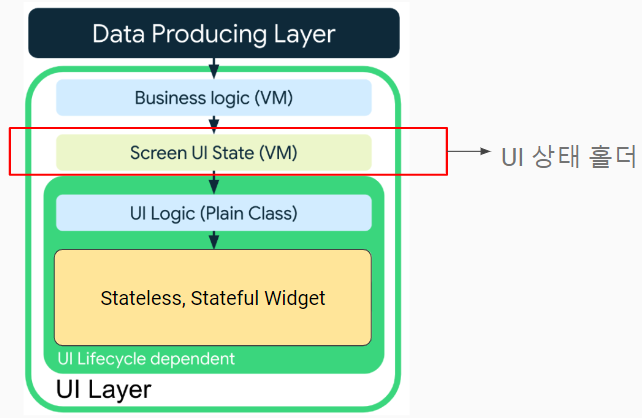

# 상태 모으기 - ViewModel 개선

## UI 상태



- Screen UI state
    - UI를 표시하기 위한 데이터 (ViewModel 변수)
- UI element state
    - Widget의 상태를 관리하는 요소들
    - PageView의 인덱스 번호
    - BottomNaviagtionBar의 인덱스 번호
    - TextEditingController (플러터에선 뷰모델에 넣는 게 코드가 간결)

## logic

- UI state는 정적인 속성이 아니라 변수
- 시간이 흐름에 따라 사용자 액션에 따라 변경되며 그 로직은 ViewModel이 담당

- logic의 종류
    - UI 수명 주기와 무관
        - 비즈니스 로직 : ViewModel 메서드
        - 화면 UI 상태 : ViewModel 변수
    - UI 수명 주기에 종속
        - UI 로직 : Widget 내부의 로직

## UI 레이어의 로직 적용 흐름



## 상태를 모으는 이유

- ViewModel에서 다루는 상태(변수)가 많으면 복잡해짐
- UI 상태 홀더를 만들어서 관리

```dart

List<Photo> _photos = [];

List<Photo> get photos => List.unmodifiable(_photos);

bool _isLoading = false;

bool get isLoading => _isLoading;
```

## UI 상태 홀더

- UI 표현을 위한 상태를 저장하는 클래스
- State 또는 UI State 클래스라고 부르기
- UI 상태 홀더의 책임
    - 간단한 UI
    - 유지관리
    - 테스트 가능성
    - 가독성

## UI 상태 홀더 클래스의 위치



## data class로 UI 상태 홀더를 만들어서 상태 모으기

- freezed 사용하지 않아도 무방하지만 편리하므로 사용
- 불변 객체 + 6종 세트(== override 등) + List를 알아서 unmodifiable로 만듦

```dart
@freezed
class SearchListState with _$SearchListState {
  const factory SearchListState({
    @Default([]) List<Photo> photos,
    @Default(false) bool isLoading,
  }) = _SearchListState;

  factory SearchListState.fromJson(Map<String, Object?> json) => _$SearchListStateFromJson(json);
}
```

## 정리된 상태

```dart

SearchListState _state = const SearchListState();

SearchListState get state => _state;
```

- View에서 UI 구현 시 state만 보면 됨

```dart

final viewModel = context.watch<SearchListViewModelV1>();
final state = viewModel.state;

// some widget...
child: state.isLoading

// some widget...
children: state.photos
```

## UI의 상태 변경

- copyWith()을 활용

```dart
_state = state.copyWith(
  photos: await _photoRepository.getPhotos(query),
  isLoading: false,
);
```

## 정리

- 화면 하나에 하나의 UI 상태 홀더를 가지도록 한다
- 일반적으로 ViewModel 에서 처리한다
- 상태 홀더가 반드시 필요한 것은 아니다. 간단한 UI 는 간단히 처리하자
- ViewModel은 전체 화면에서만 사용해야 한다
- ViewModel의 인스턴스를 하위 UI 요소에 전파하지 않는다
    - 이렇게 되면 UI 재사용성도 떨어지고
    - 테스트 불가
    - 디버깅도 어렵다
