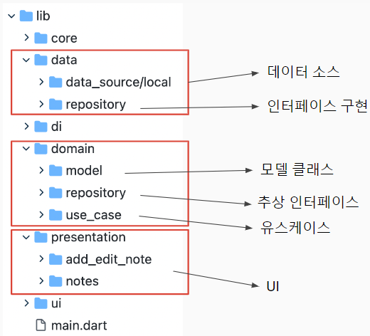
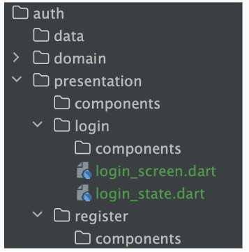
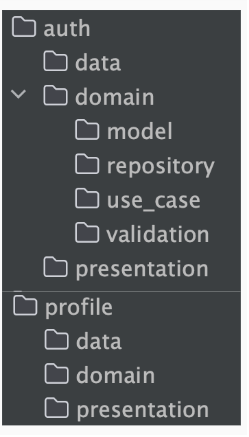
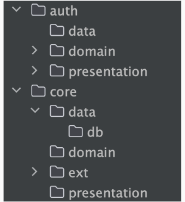

## Use Case

앱 사용시 사용자의 액션들

### 기존 코드 개선

레파지토리의 비즈니스 로직 제거

뷰모델로 옮김

로직이 길어지면 별도 클래스로 작성

뷰모델에 유즈케이스 주입

## Clean Architecture

앱이 커질 수록 모델, ui, 뷰모델 찾는 것에 고통

### Layers - Data, Domain, Presentation

- 데이터

    - Database, Remote API, Preference 등 구현

    - DB 엔터티 맵퍼 & DTO

    - 레포지토리 구현

    - 데이터 형태에 따라 local / remote 로 구분할 수 있다

- 도메인

    - 앱에 꼭 필요한 것들이 담긴 레이어

    - 아키텍처의 가장 핵심이 되는 레이어

    - 비즈니스 로직이 포함된 Use Case를 포함

    - 모델 클래스를 포함

    - repository 정의

    - 이외에도 service, logic, exception, validation, event, command 등 도메인에 필요한 내용이 올 수 있음

- 프레젠테이션 : UI

    - 모든 화면, 컴포넌트를 포함한 위젯들 (UI)

    - ViewModel을 포함

### 권장 디렉토리 구조

### Clean Architecture 장점

ViewModel 이 어떤 기능을 하는지 직관적으로 파악 가능

Repository 수정사항에 따른 ViewModel 에서의 의존성 제거

클린 아키텍처의 목적 중 하나인 변경의 최소화를 만족하기 위해

여러 ViewModel 에 동일한 기능이 있을 경우 기능의 재사용

### Use Case 코드

하나의 클래스가 하나의 동작 = 단일 책임 원칙

call() 메서드에 기능을 구현하면 호출부에서 함수명이 아닌 클래스 이름만으로 호출 가능 (Dart 의 특성)

call을 쓰면 코드 타고 들어가기가 귀찮아서 excute 사용

UseCase를 ViewModel의 생성자로 받아서 사용하면 ViewModel의 코드가 간단해짐

### Use Case 네이밍 컨벤션

- 현재 시제의 동사 + 명사/대상(선택사항) + UseCase.

- ex)
    - FormatDateUseCase,
    - LogOutUserUseCase,
    - GetLatestNewsWithAuthorsUseCase,
    - MakeLoginRequestUseCase

### 데이터 액세스 제한

UI에서 Data layer로 직접 액세스 할 수 없게 함.

- 장점 : 데이터 레이어에 대한 각 액세스 요청과 관련하여 분석 로깅을 실행하는 경우와 같이 UI가 도메인 레이어 로직을 우회하지 않게 된다.

- 단점 : 단순 호출의 경우에는 특별한 장점 없이 복잡성이 증가할 수 있다

꼭 필요한 경우만 UseCase를 사용하는 것이 좋다

### 팁: UseCase를 인터페이스로 정의하여 제약을 줄 수도 있다

### 도메인 별 클린 아키텍처

- 훨씬 더 복잡해 보이지만 우리의 목표는 더 복잡한 프로젝트를 수행하기 위함
- 각 기능의 크기가 제한되어 있기 때문에 훨씬 더 잘 확장됨
- 앱이 성장하더라도 기존 기능에 영향을 덜 줌
- 이 구조는 명확하고 일관성이 있어 새로운 개발자가 빠르게 이해할 수 있음

### presentation 추천 구조

- 한 눈에 구조를 파악할 수 있음

### 도메인 유형 기반 구조

- 확장 가능한 소규모 앱의 경우에 선호함
- 폴더 구조가 직관적임
- 확장이 용이함
- 모델 클래스가 엄청 많으면 폴더가 무지 커지고 찾기가 어려워짐

### 도메인 객체 기반 구조

- 대규모 앱의 경우에 선호함
- 객체별로 기능을 찾기 수월함
- 비지니스 로직이 단순하고 변경 가능성이 적을 경우 용이함
- 모델 클래스가 엄청 많은 경우에 추천

### core

- 모든 모듈이 참조해야 하는 공통 기능이 있는 경우 core 디렉토리에 공통 부분을 작성

### 좋은 아키텍처가 클린 아키텍처와 동의어는 아니다

- 대부분의 개발자는 좋은 아키텍처를 가지려면 항상 클린 아키텍처를 고수해야 한다고 맹신한다
- 클린 아키텍처는 좋은 아키텍처를 달성하기 위한 도구이다
- 좋은 아키텍처
    - 관심사 분리 (앱을 별개의 레이어로 나누기)
    - 모듈식 (낮은 결합도, 높은 응집력)
    - 프로젝트의 조건에 맞는 (친구랑 둘이 할 때와, 10명이서 할 때는 다른 방식이 필요)

- 클린 아키텍처가 모든 시나리오에 적합한 솔루션은 아니다
- 클린 아키텍처에 집중하기 보다는 아키텍처를 좋게 만드는 요소에 집중해라
