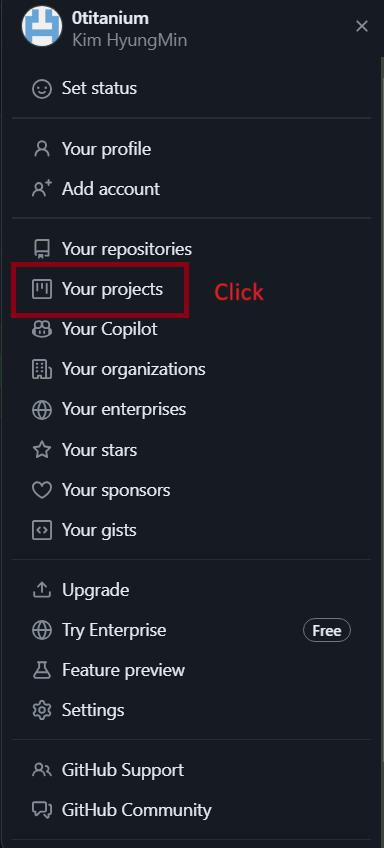
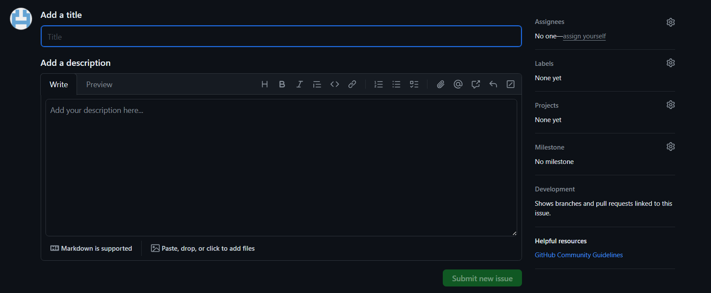

# Github issue, branch

## Github organization

- new organizaiton 클릭

- Repository 생성

- 이슈 등록

- assigness
- labels
- project
- title
- description
- submit new issue
- developmetn에서 branch 클릭
- git fetch origin
- git checkout branch_name

## 작업 순서

- 이슈에 등록한 branch에서 작업
- 완료 후 add, commit
- 작업 중인 branch에 git push origin branch
- dev로 pull request (merge할 곳 확인 필수)
- merge
- delete 작업 중인 branch
- git pull origin dev
- local에서도 작업 중인 branch 삭제 (git branch -D branch_name)
- 처음부터 반복